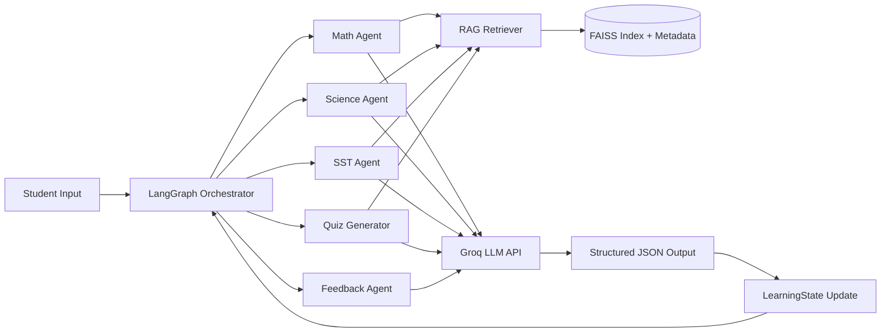
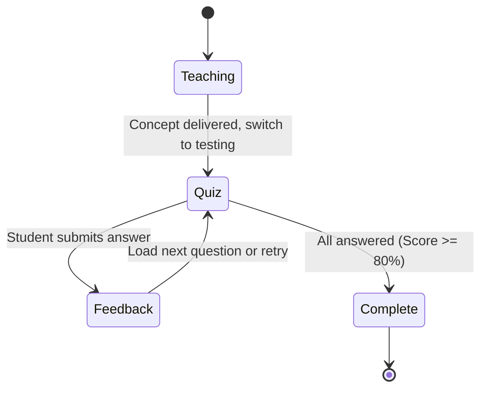

# 🎓 TeacherJi: AI-Powered NCERT Learning Platform


**TeacherJi** is an intelligent, personalized, and interactive learning system designed for students. By combining **Retrieval-Augmented Generation (RAG)** over official NCERT textbooks with a **Multi-Agent LangGraph Orchestrator**, TeacherJi provides grounded, hallucination-free tutoring, dynamic quiz generation, and personalized feedback.

---

## ✨ Key Features

- 🧠 **Multi-Agent Architecture:** Specialized, autonomous AI agents for Math, Science, and Social Studies (SST).
- 📚 **100% NCERT Grounded:** Uses FAISS vector search to retrieve exact paragraphs from textbooks, ensuring answers are strictly curriculum-aligned.
- 📝 **Dynamic Quizzing & Feedback:** Generates contextual questions on the fly, evaluates student answers, and tracks weak topics for future revision.
- ⚡ **High Performance:** Built on an asynchronous **FastAPI** backend with **PostgreSQL** for persistent profiles and **Redis** for lightning-fast session state.
- 🎨 **Interactive UI:** A highly responsive, animated frontend that guides students through a continuous learning loop.

---

## 🏗️ Architecture & Workflows

### 1. Overall System Architecture
TeacherJi uses a modular architecture separating the stateful graph orchestrator from the stateless LLM and vector stores.



### 2. The Learning Lifecycle
The session flows naturally from teaching a topic, to testing the student, to providing personalized feedback based on their performance.



---

## 🛠️ Tech Stack

**Frontend**
- React 18 & TypeScript
- Vite for lightning-fast HMR and building
- Framer Motion for micro-animations

**Backend**
- **FastAPI** (Async web framework)
- **LangGraph** (Multi-agent orchestration & state routing)
- **Groq** (Ultra-low latency LLM inference using `llama-3.3-70b-versatile`)
- **asyncpg** & **redis.asyncio** (Database drivers)

**AI & RAG**
- **FAISS** (Local vector database)
- **Sentence-Transformers** (`all-MiniLM-L6-v2` for embeddings)
- **PyMuPDF** (PDF text extraction)

**Infrastructure**
- **Render:** Backend API hosting
- **Vercel:** Frontend static hosting
- **Neon:** Serverless PostgreSQL
- **Upstash:** Serverless Redis

---

## 🚀 Quick Start (Local Development)

### Prerequisites
- Python 3.11+
- Node.js 18+
- A running PostgreSQL instance
- A running Redis instance (or Upstash URL)
- A Groq API Key

### 1. Backend Setup

```bash
cd backend

# Create and activate virtual environment
python -m venv myenv
source myenv/bin/activate  # On Windows: myenv\Scripts\activate

# Install dependencies
pip install -r requirements.txt

# Set up environment variables
cp .env.example .env
# Edit .env and add your GROQ_API_KEY, DATABASE_URL, and REDIS_URL

# Start the FastAPI server
uvicorn api.main:app --reload
```

### 2. Frontend Setup

```bash
cd frontend

# Install dependencies
npm install

# Set up environment variables
# Create a .env file and add: VITE_API_URL=http://localhost:8000

# Start the development server
npm run dev
```

---

## 🧠 Managing the Knowledge Base (RAG)

TeacherJi's intelligence comes from its offline vector indices. To add new textbooks:

1. Place your NCERT textbook PDFs in the `backend/data/` folder.
2. Run the ingestion script from the `backend/` directory:
   ```bash
   python -m rag.ingest --subject math --grade 6 --pdf data/math_class6.pdf
   ```
3. This will chunk the text, generate embeddings, and save the `.faiss` and `_meta.json` files to `backend/rag/index/`.

---

## 🌍 Production Deployment

### Backend (Render)
1. Create a **PostgreSQL** database on Render or Neon.
2. Create a new **Web Service** on Render pointing to the `backend/` root directory.
3. Select the **Docker** environment.
4. Add your `GROQ_API_KEY`, `DATABASE_URL`, and `REDIS_URL` to the Render environment variables.

### Frontend (Vercel)
1. Import the project into Vercel.
2. Set the Root Directory to `frontend/`.
3. Add the `VITE_API_URL` environment variable pointing to your live Render backend URL.
4. Deploy!


a fresh issue has come up
my deployment has exeeded the memory limit
so imma try hugging face emmbeddings to get this done
may be this will reduce some load
but  my FAISS database might also be the problem