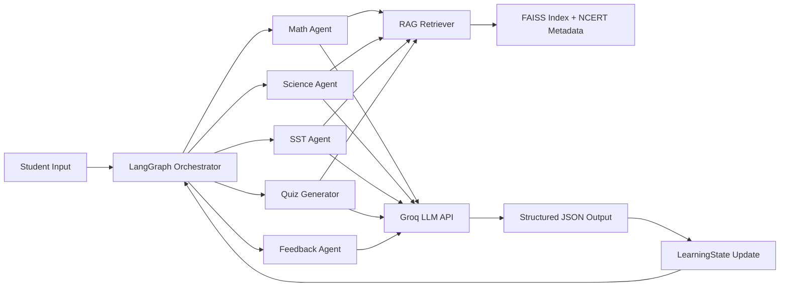
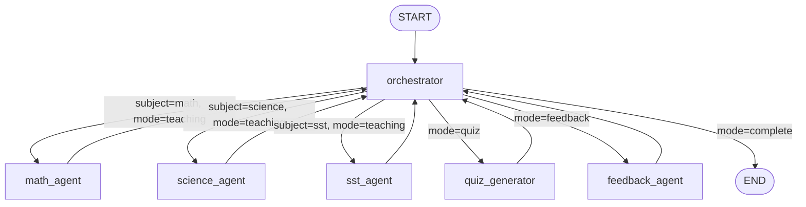
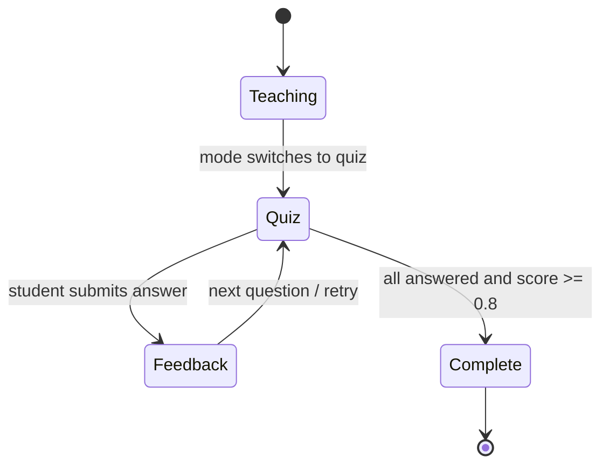
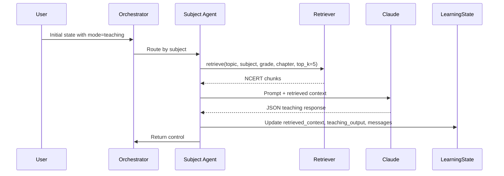
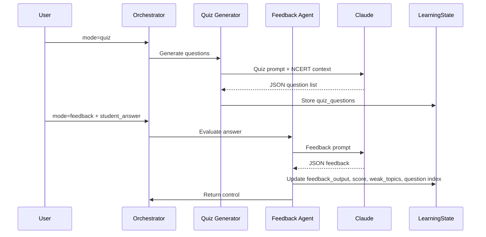

# NCERT Learning Platform

This project is an NCERT-grounded learning system for school subjects. It currently contains two major pieces:

1. A RAG layer for retrieving chapter-specific NCERT content.
2. A LangGraph multi-agent orchestration layer for teaching, quizzing, and feedback.

## System Visualization

### Overall Architecture



### Agent Graph Routing



### Session Lifecycle



## Work Completed

### 1. RAG Pipeline

The `rag/` package is in place and provides retrieval over NCERT textbook chunks.

- `rag/ingest.py`
  Builds FAISS indexes from NCERT PDFs and writes matching metadata JSON files.
- `rag/retriever.py`
  Exposes `retrieve(query, subject, grade, chapter=None, top_k=5) -> list[dict]`.
  It:
  - loads the correct FAISS index by subject and grade
  - loads metadata from `rag/index/*_meta.json`
  - embeds the user query with `sentence-transformers/all-MiniLM-L6-v2`
  - filters by chapter when provided
  - returns the top matching NCERT chunks
- `rag/test_retriever.py`
  Basic retriever test coverage.

Indexed data currently present in `rag/index/`:

- `math_class6.faiss`
- `math_class6_meta.json`
- `sst_class6.faiss`
- `sst_class6_meta.json`

## 2. LangGraph Multi-Agent System

The `agents/` package has been added to implement the multi-agent orchestration system.

### File Structure

- `agents/state.py`
  Shared `LearningState` `TypedDict`.
- `agents/orchestrator.py`
  Pure Python router node.
- `agents/subject_agents.py`
  Math, Science, and SST teaching agents.
- `agents/quiz_agent.py`
  Quiz Generator and Feedback Agent.
- `agents/prompts.py`
  All system prompts stored as constants.
- `agents/graph.py`
  LangGraph graph assembly and `run_session(initial_state)` entrypoint.
- `agents/__init__.py`
  Re-exports `LearningState`, `app`, and `run_session`.

### State Schema

`LearningState` currently supports:

- `student_id`
- `grade`
- `subject`
- `chapter`
- `topic`
- `mode`
- `retrieved_context`
- `teaching_output`
- `quiz_questions`
- `current_question_index`
- `student_answer`
- `feedback_output`
- `session_score`
- `weak_topics`
- `messages`

### Orchestrator

The orchestrator:

- runs first on every graph invocation
- makes no LLM call
- routes based on `mode`
- routes teaching mode by `subject`
- marks the session as `complete` when:
  - `mode == "quiz"`
  - all questions are answered
  - `session_score >= 0.8`

Routing map used:

- `math -> math_agent`
- `science -> science_agent`
- `sst -> sst_agent`
- `quiz -> quiz_generator`
- `feedback -> feedback_agent`

### Subject Agents

Implemented subject agents:

- `math_agent`
- `science_agent`
- `sst_agent`

Each subject agent follows the same pattern:

1. Calls `retrieve(topic, subject, grade, chapter, top_k=5)`.
2. Stores retrieved chunks in `state["retrieved_context"]`.
3. Formats those chunks into a single context string.
4. Calls Groq with the agent-specific system prompt.
5. Forces JSON-only output.
6. Parses the JSON response.
7. Updates `state["teaching_output"]`.
8. Appends the result to `state["messages"]`.

Model settings:

- Provider: Groq
- Default model: `openai/gpt-oss-120b`
- Override model with: `GROQ_MODEL`
- Temperature for teaching agents: `0.3`

### Quiz and Feedback Agents

Implemented:

- `quiz_generator`
- `feedback_agent`

`quiz_generator`:

- uses retrieved NCERT context
- builds quiz questions grounded in that context only
- prioritizes `weak_topics`
- returns parsed JSON question objects into `state["quiz_questions"]`

`feedback_agent`:

- evaluates the current student answer
- returns structured feedback JSON
- updates:
  - `feedback_output`
  - `session_score`
  - `weak_topics`
  - `current_question_index`

## 3. Prompt Layer

Exact prompt constants were added in `agents/prompts.py` for:

- `MATH_AGENT_PROMPT`
- `SCIENCE_AGENT_PROMPT`
- `SST_AGENT_PROMPT`
- `QUIZ_GENERATOR_PROMPT`
- `FEEDBACK_AGENT_PROMPT`

These prompts are designed to keep every response grounded in the retrieved NCERT context and to return structured JSON.

## 4. Graph Assembly

The LangGraph graph is assembled in `agents/graph.py` using `StateGraph(LearningState)`.

### Graph Structure Snapshot

```text
START
  -> orchestrator
     -> math_agent -> orchestrator
     -> science_agent -> orchestrator
     -> sst_agent -> orchestrator
     -> quiz_generator -> orchestrator
     -> feedback_agent -> orchestrator
     -> END
```

Nodes added:

- `orchestrator`
- `math_agent`
- `science_agent`
- `sst_agent`
- `quiz_generator`
- `feedback_agent`

Edges added:

- `START -> orchestrator`
- conditional edges from `orchestrator`
- each subject agent returns to `orchestrator`
- `quiz_generator` returns to `orchestrator`
- `feedback_agent` returns to `orchestrator`

Compiled graph entrypoint:

- `app = graph.compile()`
- `run_session(initial_state: dict) -> LearningState`

### Teaching Flow Visualization



### Quiz and Feedback Flow Visualization



## 5. Dependencies Added

`requirements.txt` now includes:

- `PyMuPDF==1.24.0`
- `sentence-transformers==2.7.0`
- `faiss-cpu==1.8.0`
- `numpy<2`
- `tqdm`
- `langgraph`
- `groq`

## 6. Environment Notes

The project is being run from the conda environment located at:

- `myenv`

Verification was done using:

- `.\myenv\python.exe`

Environment variables are loaded automatically from a local `.env` file via `python-dotenv`.

Typical setup:

```env
GROQ_API_KEY=your_groq_api_key_here
GROQ_MODEL=openai/gpt-oss-120b
```

## 7. Verification Completed

The following checks were completed:

- Python syntax check passed for the new `agents/` package.
- `groq` and `langgraph` were installed into `myenv`.
- `agents.graph` imports successfully in `myenv`.
- `run_session({"mode": "complete"})` executes successfully and returns:

```python
{"mode": "complete"}
```

## 8. Current Limitation

Live teaching, quiz generation, and feedback flows require a valid Groq API key in the active environment. The graph structure and imports are verified, but live LLM calls were not executed without credentials.
