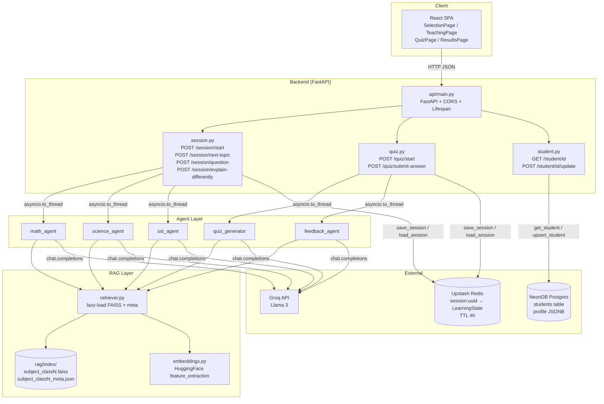
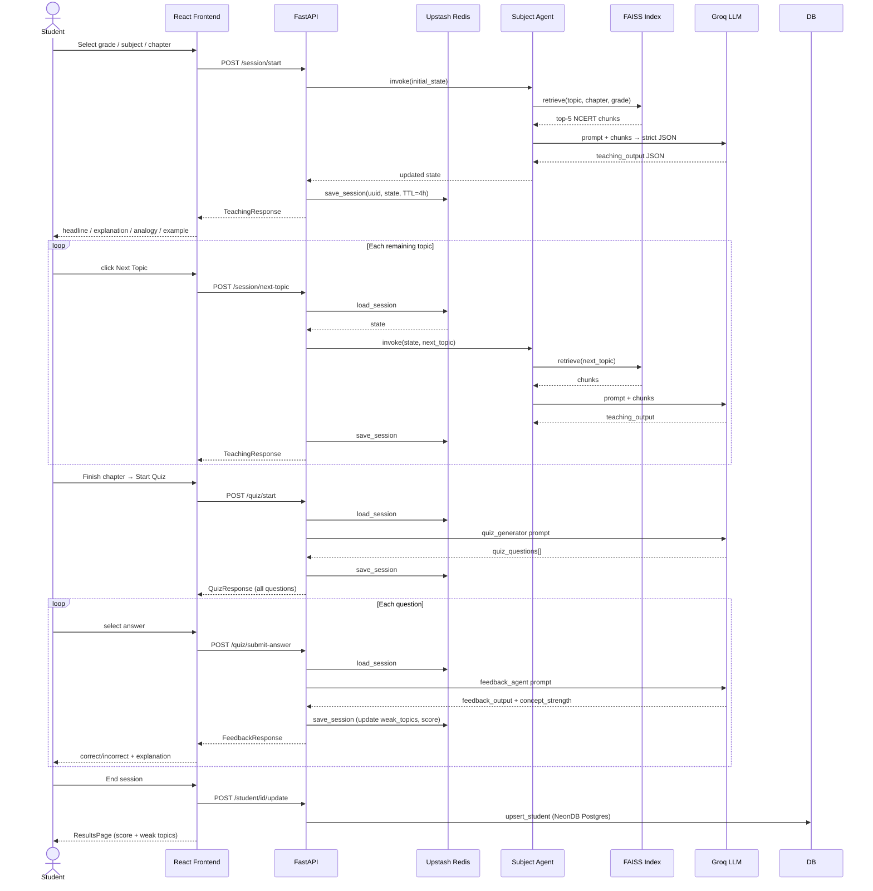
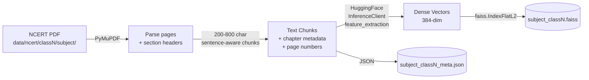
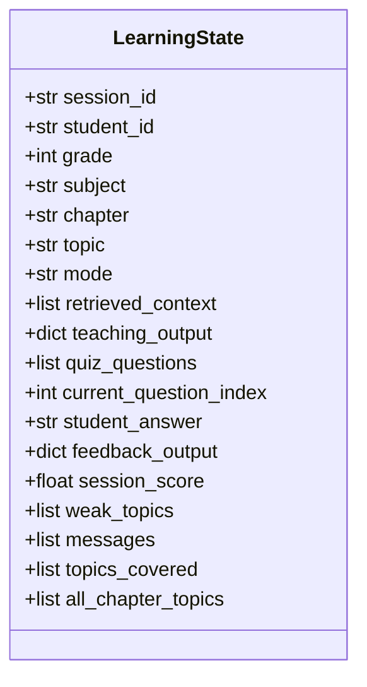

# TeacherJi — NCERT RAG Tutoring Platform


TeacherJi is a retrieval-augmented, multi-agent tutoring system that delivers NCERT-grounded teaching, quizzes, and targeted feedback. It combines an offline FAISS vector index of NCERT textbooks with structured LLM prompts to produce curriculum-aligned outputs.

---

## Table of Contents
- [Overview](#overview)
- [Quickstart](#quickstart-local-development)
- [Architecture](#architecture)
- [Components](#components)
- [API Reference](#api-reference)
- [Data & Persistence](#data-models--persistence)
- [Environment Variables](#environment-variables)

---

## Overview

- Grounded teaching: every explanation and quiz is generated from retrieved NCERT text chunks.
- Multi-agent design: subject-specific agents (math, science, SST), a quiz generator, and a feedback evaluator.
- Short-lived sessions: Upstash Redis stores `LearningState` per session (4h TTL); NeonDB Postgres stores persistent student profiles.

---

## Quickstart (local development)

**Prerequisites:** Python 3.11+, Node.js 18+, Groq API key, Upstash Redis, NeonDB Postgres

**Backend**
```bash
cd backend
python -m venv .venv
.venv\Scripts\activate    # Windows
pip install -r requirements.txt
# copy .env.example -> .env and fill secrets
uvicorn api.main:app --reload --port 8000
```

**Frontend**
```bash
cd frontend
npm install
# set VITE_API_URL in frontend/.env
npm run dev
```

**RAG ingestion** (run once per subject/grade)
```bash
cd backend
python -m rag.ingest --subject math --grade 6 --pdf_dir data/ncert/class6/math
```

---

## Architecture

### System Architecture


```mermaid
flowchart TD
    subgraph Client
        UI[React SPA\nSelectionPage / TeachingPage\nQuizPage / ResultsPage]
    end

    subgraph Backend["Backend (FastAPI)"]
        API[api/main.py\nFastAPI + CORS + Lifespan]
        SR[session.py\nPOST /session/start\nPOST /session/next-topic\nPOST /session/question\nPOST /session/explain-differently]
        QR[quiz.py\nPOST /quiz/start\nPOST /quiz/submit-answer]
        STR[student.py\nGET /student/id\nPOST /student/id/update]
    end

    subgraph Agents["Agent Layer"]
        MA[math_agent]
        SCA[science_agent]
        SST[sst_agent]
        QA[quiz_generator]
        FA[feedback_agent]
    end

    subgraph RAG["RAG Layer"]
        RET[retriever.py\nlazy-load FAISS + meta]
        IDX[(rag/index/\nsubject_classN.faiss\nsubject_classN_meta.json)]
        EMB[embeddings.py\nHuggingFace feature_extraction]
    end

    subgraph External
        GROQ[Groq API\nLlama 3]
        REDIS[(Upstash Redis\nsession:uuid → LearningState\nTTL 4h)]
        PG[(NeonDB Postgres\nstudents table\nprofile JSONB)]
    end

    UI -->|HTTP JSON| API
    API --> SR & QR & STR
    SR -->|asyncio.to_thread| MA & SCA & SST
    QR -->|asyncio.to_thread| QA & FA
    MA & SCA & SST & QA & FA --> RET
    RET --> IDX
    RET --> EMB
    MA & SCA & SST & QA & FA -->|chat.completions| GROQ
    SR & QR -->|save_session / load_session| REDIS
    STR -->|get_student / upsert_student| PG
```

---

### Teaching → Quiz → Feedback Flow


```mermaid
sequenceDiagram
    actor Student
    participant UI as React Frontend
    participant API as FastAPI
    participant Redis as Upstash Redis
    participant Agent as Subject Agent
    participant FAISS as FAISS Index
    participant Groq as Groq LLM

    Student->>UI: Select grade / subject / chapter
    UI->>API: POST /session/start
    API->>Agent: invoke(initial_state)
    Agent->>FAISS: retrieve(topic, chapter, grade)
    FAISS-->>Agent: top-5 NCERT chunks
    Agent->>Groq: prompt + chunks → strict JSON
    Groq-->>Agent: teaching_output JSON
    Agent-->>API: updated state
    API->>Redis: save_session(uuid, state, TTL=4h)
    API-->>UI: TeachingResponse
    UI-->>Student: headline / explanation / analogy / example

    loop Each remaining topic
        Student->>UI: click Next Topic
        UI->>API: POST /session/next-topic
        API->>Redis: load_session
        Redis-->>API: state
        API->>Agent: invoke(state, next_topic)
        Agent->>FAISS: retrieve(next_topic)
        FAISS-->>Agent: chunks
        Agent->>Groq: prompt + chunks
        Groq-->>Agent: teaching_output
        API->>Redis: save_session
        API-->>UI: TeachingResponse
    end

    Student->>UI: Finish chapter → Start Quiz
    UI->>API: POST /quiz/start
    API->>Redis: load_session
    API->>Groq: quiz_generator prompt
    Groq-->>API: quiz_questions[]
    API->>Redis: save_session
    API-->>UI: QuizResponse (all questions)

    loop Each question
        Student->>UI: select answer
        UI->>API: POST /quiz/submit-answer
        API->>Redis: load_session
        API->>Groq: feedback_agent prompt
        Groq-->>API: feedback_output + concept_strength
        API->>Redis: save_session (update weak_topics, score)
        API-->>UI: FeedbackResponse
        UI-->>Student: correct/incorrect + explanation
    end

    Student->>UI: End session
    UI->>API: POST /student/id/update
    API->>DB: upsert_student (NeonDB Postgres)
    UI-->>Student: ResultsPage (score + weak topics)
```

---

### RAG Ingestion Pipeline


```mermaid
flowchart LR
    PDF[NCERT PDF\ndata/ncert/classN/subject/] -->|PyMuPDF| PARSE[Parse pages\n+ section headers]
    PARSE -->|200-800 char\nsentence-aware chunks| CHUNK[Text Chunks\n+ chapter metadata\n+ page numbers]
    CHUNK -->|HuggingFace\nInferenceClient\nfeature_extraction| EMBED[Dense Vectors\n384-dim]
    EMBED -->|faiss.IndexFlatL2| FIDX[(subject_classN.faiss)]
    CHUNK -->|JSON| META[(subject_classN_meta.json)]
```

---

### LearningState (Redis session schema)


```mermaid
classDiagram
    class LearningState {
        +str session_id
        +str student_id
        +int grade
        +str subject
        +str chapter
        +str topic
        +str mode
        +list retrieved_context
        +dict teaching_output
        +list quiz_questions
        +int current_question_index
        +str student_answer
        +dict feedback_output
        +float session_score
        +list weak_topics
        +list messages
        +list topics_covered
        +list all_chapter_topics
    }
```

---

## Components

### Backend
| File | Responsibility |
|---|---|
| `api/main.py` | FastAPI app, lifespan (Redis + Postgres init), CORS |
| `api/routes/session.py` | Teaching phase — start, next-topic, question, re-explain |
| `api/routes/quiz.py` | Quiz phase — start quiz, submit answer |
| `api/routes/student.py` | Persistent profile — get, update |
| `api/db.py` | Upstash Redis REST client + asyncpg helpers |
| `api/curriculum.py` | Canonical grade/subject/chapter → topic list mapping |
| `agents/subject_agents.py` | `math_agent`, `science_agent`, `sst_agent` |
| `agents/quiz_agent.py` | `quiz_generator`, `feedback_agent` |
| `agents/prompts.py` | Strict JSON-only prompt templates |
| `rag/ingest.py` | PDF → chunks → embeddings → FAISS index |
| `rag/retriever.py` | Lazy-load FAISS, embed query, top-k search |
| `rag/embeddings.py` | HuggingFace `feature_extraction` provider |

### Frontend
| File | Responsibility |
|---|---|
| `pages/SelectionPage.tsx` | Grade / subject / chapter picker, calls `startSession` |
| `pages/TeachingPage.tsx` | Renders `TeachingCard` (headline, explanation, analogy, example) |
| `pages/QuizPage.tsx` | MCQ quiz flow + `FeedbackPanel` per answer |
| `pages/ResultsPage.tsx` | Session score + weak topics + revision option |
| `store/sessionStore.ts` | Zustand store — single source of truth for client state |
| `api/client.ts` | Typed fetch wrappers for all API endpoints |

---

## API Reference

| Method | Endpoint | Description |
|---|---|---|
| POST | `/session/start` | Start session, teach first topic |
| POST | `/session/next-topic` | Advance to next topic or signal chapter complete |
| POST | `/session/question` | Follow-up question → reteach current topic |
| POST | `/session/explain-differently` | Re-explain with different examples |
| POST | `/quiz/start` | Generate all MCQ questions for the chapter |
| POST | `/quiz/submit-answer` | Evaluate one answer → feedback + score update |
| GET | `/student/{student_id}` | Get persistent profile from Postgres |
| POST | `/student/{student_id}/update` | Merge session results into profile |
| GET | `/health` | Redis + Postgres connectivity check |

---

## Data Models & Persistence

**Upstash Redis** — transient session state
- Key: `session:{uuid}`, TTL: 4 hours
- Value: `LearningState` serialized as JSON

**NeonDB Postgres** — persistent student profiles
```sql
CREATE TABLE students (
    student_id  TEXT PRIMARY KEY,
    grade       INT  NOT NULL,
    profile     JSONB NOT NULL DEFAULT '{}',  -- topics_mastered, weak_topics, quiz_history
    created_at  TIMESTAMP NOT NULL DEFAULT NOW(),
    updated_at  TIMESTAMP NOT NULL DEFAULT NOW()
);
```

---

## Environment Variables

| Variable | Description |
|---|---|
| `GROQ_API_KEY` | Groq inference API key |
| `DATABASE_URL` | NeonDB Postgres DSN (`postgresql://...`) |
| `UPSTASH_REDIS_REST_URL` | Upstash Redis REST URL (`https://...upstash.io`) |
| `UPSTASH_REDIS_REST_TOKEN` | Upstash Redis REST token |
| `EMBEDDING_PROVIDER` | `huggingface` or `google` |
| `HF_API_TOKEN` | Hugging Face token |
| `HF_EMBEDDING_MODEL` | e.g. `microsoft/harrier-oss-v1-0.6b` |


## Dev Timeline

a fresh issue has come up
my deployment has exeeded the memory limit
so imma try hugging face emmbeddings to get this done
may be this will reduce some load
but  my FAISS database might also be the problem

my HF model is not working its giving some HTTPS error
I am getting this error when trying to use the Hugging Face API for embeddings:

changed the model


it was not the issue
The real problem was model/task mismatch:

sentence-transformers/all-MiniLM-L6-v2 and intfloat/multilingual-e5-small are served by HF Inference as sentence-similarity, not feature-extraction.
my RAG needs raw embedding vectors, so it must use HF feature_extraction.
I switched the code to Hugging Face’s official InferenceClient.feature_extraction path and changed the model to one that actually works with my setup: microsoft/harrier-oss-v1-0.6b.


still this doesn't work the backend is throwing 404 error
and render shows failed to generate

Final issue was:

my UI/backend curriculum still had old Class 6 math chapters like Whole Numbers.
my rebuilt PDF/index has current chapters like Number Play, Prime Time, The Other Side of Zero.
Because of that mismatch, retrieval returned no NCERT context.
Then the math prompt asked Groq for a “bold statement”, so Groq generated invalid JSON like:
"headline": **"Natural and Whole Numbers Introduction"**


I fixed:

JSON prompts: no markdown/bold/unquoted values.
Groq retry: adds strict JSON correction after JSON-mode rejection.
Teaching retrieval: if chapter-filtered retrieval returns empty, it retries without stale chapter filter.
Quiz retrieval: same fallback.
Class 6 math curriculum in backend and frontend now matches the ingested PDF chapters.
Verified a production-like math agent call succeeds:
dict_keys([...])
Numbers in daily life
5 retrieved chunks

---