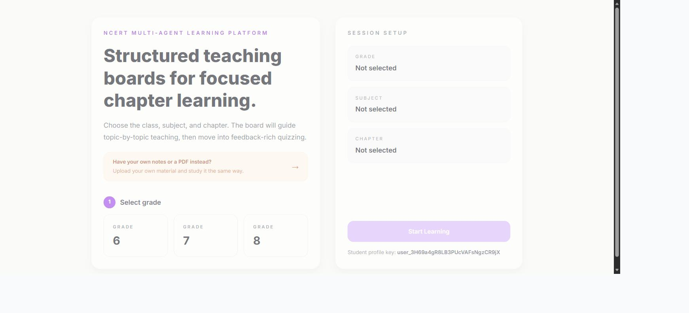
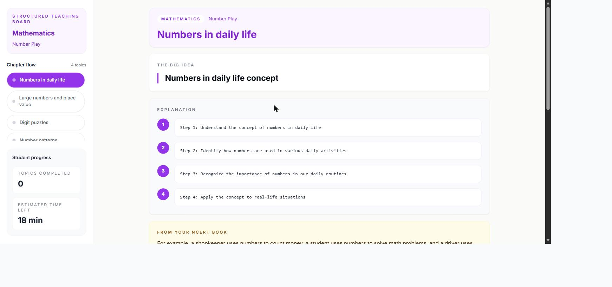
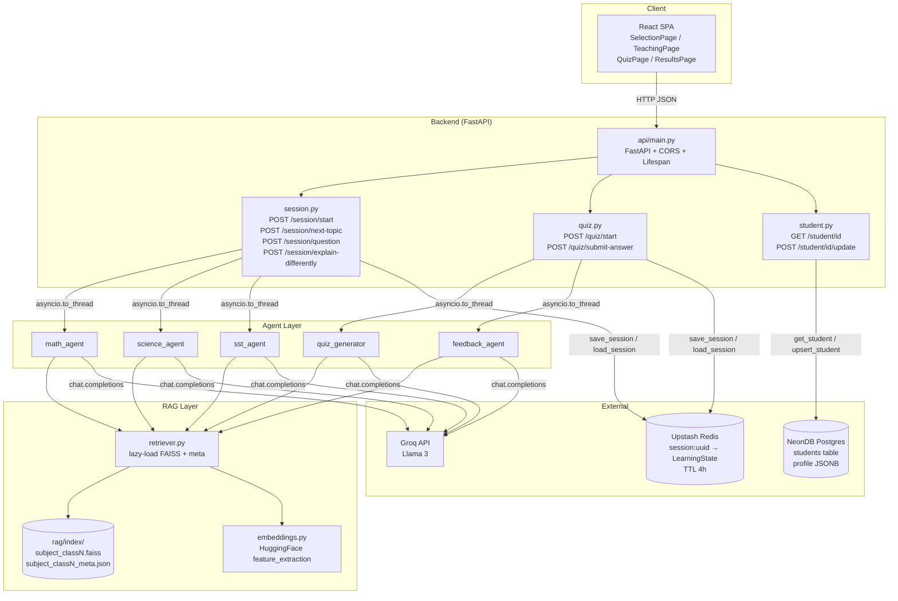
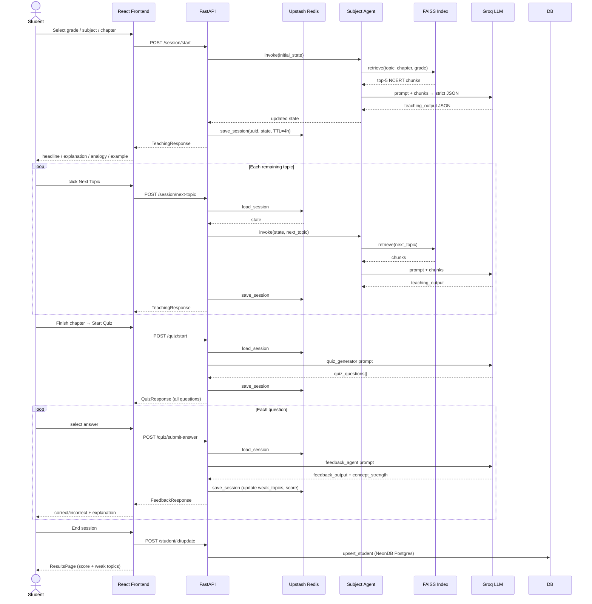
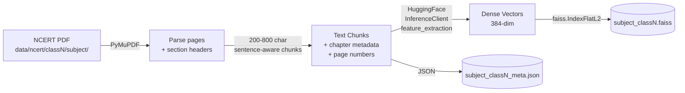
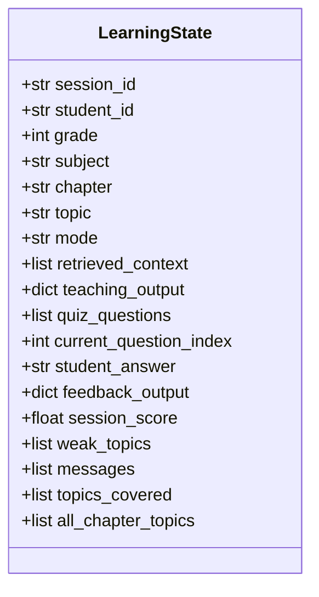
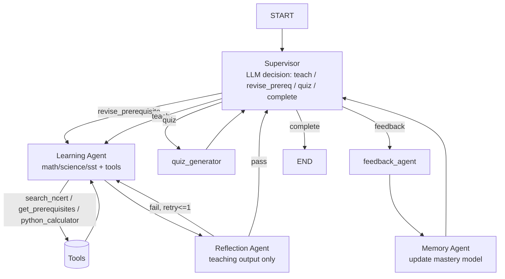

<details>
<summary>📓 engineering log — raw, messy, exactly how it happened (click to expand)</summary>

## Deployment memory limits and the embedding model saga

a fresh issue has come up
my deployment has exeeded the memory limit
so imma try hugging face emmbeddings to get this done
may be this will reduce some load
but  my FAISS database might also be the problem

my HF model is not working its giving some HTTPS error
I am getting this error when trying to use the Hugging Face API for embeddings:

changed the model


it was not the issue
The real problem was model/task mismatch:

sentence-transformers/all-MiniLM-L6-v2 and intfloat/multilingual-e5-small are served by HF Inference as sentence-similarity, not feature-extraction.
my RAG needs raw embedding vectors, so it must use HF feature_extraction.
I switched the code to Hugging Face's official InferenceClient.feature_extraction path and changed the model to one that actually works with my setup: microsoft/harrier-oss-v1-0.6b.


still this doesn't work the backend is throwing 404 error
and render shows failed to generate

Final issue was:

my UI/backend curriculum still had old Class 6 math chapters like Whole Numbers.
my rebuilt PDF/index has current chapters like Number Play, Prime Time, The Other Side of Zero.
Because of that mismatch, retrieval returned no NCERT context.
Then the math prompt asked Groq for a "bold statement", so Groq generated invalid JSON like:
"headline": **"Natural and Whole Numbers Introduction"**


I fixed:

JSON prompts: no markdown/bold/unquoted values.
Groq retry: adds strict JSON correction after JSON-mode rejection.
Teaching retrieval: if chapter-filtered retrieval returns empty, it retries without stale chapter filter.
Quiz retrieval: same fallback.
Class 6 math curriculum in backend and frontend now matches the ingested PDF chapters.
Verified a production-like math agent call succeeds:
dict_keys([...])
Numbers in daily life
5 retrieved chunks

---

## Document upload — studying your own material, not just NCERT PDFs

new feature: let students upload their own material and study it, not just NCERT PDFs.

the whole app was built around subject (math/science/sst) + grade + chapter, with a hardcoded
topic list per chapter in curriculum.py. an uploaded PDF/txt/md has none of that, so I couldn't
just reuse the subject agents as-is.

what I did instead:
- reused the existing chunking logic from rag/ingest.py, just without the chapter-heading
  detection — an upload is chunked page by page into its own FAISS index under
  rag/index/custom/<document_id>.faiss, keyed by document_id instead of subject+grade.
- added a generic document_tutor agent (agents/document_agent.py) that isn't tied to any
  subject — it retrieves from that document's own index and teaches with a subject-agnostic
  JSON schema.
- since there's no curriculum.py entry for a random upload, I added a one-time LLM call right
  after ingestion (extract_topics) that reads a sample of the document and generates its own
  ordered topic list. that list flows into the same custom_topics field the session API already
  had, so the existing topic-by-topic teaching + quiz + feedback loop just works unmodified.
- added a documents table in Postgres so uploads are saved per student and show up as a library,
  not just a one-off session.
- new dependency: python-multipart (FastAPI needs it for multipart file uploads, otherwise
  UploadFile just breaks at runtime with a confusing error).
- kept embeddings on the remote HF path for uploads too — after the memory-limit deploy issue
  earlier, no interest in loading a local embedding model just for this.

---

## Phase 1 — the agentic core (Supervisor, Memory, Tools, Reflection)

See `master_plan.md` for the full phase-by-phase spec and design rationale — the
short version of what shipped is in the README's "Key Design Decisions" section.
Highlights worth keeping here:

- `target_topic` was returned by the Supervisor since it first shipped but was
  never declared in the `LearningState` TypedDict, so LangGraph silently
  dropped it between graph steps — harmless until `revise_prerequisite` needed
  it to survive, caught by a mocked-graph test.
- The API layer originally assumed the topic taught in a turn was always the
  topic requested. A prerequisite redirect breaks that assumption twice over
  (mislabeled response, and the real requested topic silently marked
  "covered" without ever being taught) — fixed by comparing `target_topic`
  against the requested topic rather than trusting `next_action`, which gets
  overwritten to `"complete"` by the time the graph returns regardless of
  whether a mid-turn redirect happened.
- Reflection fails open: if the reflection LLM call itself errors (bad JSON,
  API error), the teaching output is accepted rather than blocking the turn.
  It's a quality gate, not a hard dependency.

---

## Phase 2 — Clerk auth

Wired via Clerk's own CLI (`clerk init`), which pulled its setup skill from
`clerk/skills` on GitHub and installed `@clerk/react`. Backend verification
uses `PyJWT` against the instance's public JWKS endpoint — no `CLERK_SECRET_KEY`
needed backend-side, since verifying a JWT only requires the issuer's public
signing keys, and the Clerk user id doubles directly as `students.student_id`
(no separate mapping table).

One non-obvious snag during local testing: the `<SignIn/>` component's OAuth
redirect briefly lands on `#/sso-callback` and looks stuck for several
seconds while Clerk completes the token exchange — it resolves on its own
and isn't an infinite loop, but it's easy to mistake for a hang the first
time you see it.

*(full history, including anything added after this: [ENGINEERING_LOG.md](ENGINEERING_LOG.md))*

</details>

# Daskalos — NCERT RAG Tutoring Platform


Daskalos is a retrieval-augmented, multi-agent tutoring system that delivers NCERT-grounded teaching, quizzes, and targeted feedback. It combines an offline FAISS vector index of NCERT textbooks with structured LLM prompts to produce curriculum-aligned outputs.

---

## Table of Contents
- [Problem Statement](#problem-statement)
- [Screenshots](#screenshots)
- [Overview](#overview)
- [Quickstart](#quickstart-local-development)
- [Architecture](#architecture)
- [Key Design Decisions](#key-design-decisions)
- [Components](#components)
- [API Reference](#api-reference)
- [Data & Persistence](#data-models--persistence)
- [Environment Variables](#environment-variables)
- [Testing & CI](#testing--ci)
- [Limitations & Future Work](#limitations--future-work)
- [Contributing](#contributing)

---

## Problem Statement

NCERT textbooks are the shared curriculum for millions of students, but
one-size-fits-all classroom pacing means a student weak in one prerequisite
(say, fractions) keeps getting taught the next topic (percentages) regardless.
Generic LLM chat doesn't fix this either — it isn't grounded in the actual
textbook content, doesn't track what a specific student has and hasn't
mastered across sessions, and doesn't verify its own output before showing it
to a learner.

Daskalos is a multi-agent tutoring system that: (1) grounds every
explanation and quiz question in retrieved NCERT text via FAISS, not the
model's parametric memory; (2) tracks a persistent per-student mastery model
across sessions, so a session doesn't start from zero every time; (3) lets a
Supervisor agent redirect to a prerequisite refresher instead of barreling
into a topic the student isn't ready for; and (4) runs a Reflection pass over
teaching output before the student ever sees it.

## Screenshots

| Session setup | Structured teaching board |
|---|---|
|  |  |

## Overview

- Grounded teaching: every explanation and quiz is generated from retrieved NCERT text chunks.
- Multi-agent design: a Supervisor plans each turn; subject-specific Learning Agents (math, science, SST) teach with tool access; a Reflection Agent gates their output; a Memory Agent tracks per-student mastery.
- Short-lived sessions: Upstash Redis stores `LearningState` per session (4h TTL); NeonDB Postgres stores persistent student profiles.
- Authenticated: Clerk-backed accounts — every API request is tied to a verified user, not a client-generated ID.
- Live streaming: teaching generation streams token-by-token over SSE into a chat panel alongside the structured lesson card, with Markdown/KaTeX rendering.
- Observable: every LLM call is traced (LangSmith) and tagged with the prompt version that produced it; two standalone eval scripts measure RAG recall and Reflection precision/recall against seeded test sets.

---

## Quickstart (local development)

**Prerequisites:** Python 3.11+, Node.js 18+, Groq API key, Upstash Redis, NeonDB Postgres

**Backend**
```bash
cd backend
python -m venv .venv
.venv\Scripts\activate    # Windows
pip install -r requirements.txt
# copy .env.example -> .env and fill secrets
uvicorn api.main:app --reload --port 8000
```

**Frontend**
```bash
cd frontend
npm install
# set VITE_API_URL in frontend/.env
npm run dev
```

**RAG ingestion** (run once per subject/grade)
```bash
cd backend
python -m rag.ingest --subject math --grade 6 --pdf_dir data/ncert/class6/math
```

---

## Architecture

### System Architecture


```mermaid
flowchart TD
    subgraph Client
        UI[React SPA\nSelectionPage / TeachingPage\nQuizPage / ResultsPage]
    end

    subgraph Backend["Backend (FastAPI)"]
        API[api/main.py\nFastAPI + CORS + Lifespan]
        SR[session.py\nPOST /session/start\nPOST /session/next-topic\nPOST /session/question\nPOST /session/explain-differently]
        QR[quiz.py\nPOST /quiz/start\nPOST /quiz/submit-answer]
        STR[student.py\nGET /student/id\nPOST /student/id/update]
    end

    subgraph Agents["Agent Layer"]
        MA[math_agent]
        SCA[science_agent]
        SST[sst_agent]
        QA[quiz_generator]
        FA[feedback_agent]
    end

    subgraph RAG["RAG Layer"]
        RET[retriever.py\nlazy-load FAISS + meta]
        IDX[(rag/index/\nsubject_classN.faiss\nsubject_classN_meta.json)]
        EMB[embeddings.py\nHuggingFace feature_extraction]
    end

    subgraph External
        GROQ[Groq API\nLlama 3]
        REDIS[(Upstash Redis\nsession:uuid → LearningState\nTTL 4h)]
        PG[(NeonDB Postgres\nstudents table\nprofile JSONB)]
    end

    UI -->|HTTP JSON| API
    API --> SR & QR & STR
    SR -->|asyncio.to_thread| MA & SCA & SST
    QR -->|asyncio.to_thread| QA & FA
    MA & SCA & SST & QA & FA --> RET
    RET --> IDX
    RET --> EMB
    MA & SCA & SST & QA & FA -->|chat.completions| GROQ
    SR & QR -->|save_session / load_session| REDIS
    STR -->|get_student / upsert_student| PG
```

---

### Teaching → Quiz → Feedback Flow


```mermaid
sequenceDiagram
    actor Student
    participant UI as React Frontend
    participant API as FastAPI
    participant Redis as Upstash Redis
    participant Agent as Subject Agent
    participant FAISS as FAISS Index
    participant Groq as Groq LLM

    Student->>UI: Select grade / subject / chapter
    UI->>API: POST /session/start
    API->>Agent: invoke(initial_state)
    Agent->>FAISS: retrieve(topic, chapter, grade)
    FAISS-->>Agent: top-5 NCERT chunks
    Agent->>Groq: prompt + chunks → strict JSON
    Groq-->>Agent: teaching_output JSON
    Agent-->>API: updated state
    API->>Redis: save_session(uuid, state, TTL=4h)
    API-->>UI: TeachingResponse
    UI-->>Student: headline / explanation / analogy / example

    loop Each remaining topic
        Student->>UI: click Next Topic
        UI->>API: POST /session/next-topic
        API->>Redis: load_session
        Redis-->>API: state
        API->>Agent: invoke(state, next_topic)
        Agent->>FAISS: retrieve(next_topic)
        FAISS-->>Agent: chunks
        Agent->>Groq: prompt + chunks
        Groq-->>Agent: teaching_output
        API->>Redis: save_session
        API-->>UI: TeachingResponse
    end

    Student->>UI: Finish chapter → Start Quiz
    UI->>API: POST /quiz/start
    API->>Redis: load_session
    API->>Groq: quiz_generator prompt
    Groq-->>API: quiz_questions[]
    API->>Redis: save_session
    API-->>UI: QuizResponse (all questions)

    loop Each question
        Student->>UI: select answer
        UI->>API: POST /quiz/submit-answer
        API->>Redis: load_session
        API->>Groq: feedback_agent prompt
        Groq-->>API: feedback_output + concept_strength
        API->>Redis: save_session (update weak_topics, score)
        API-->>UI: FeedbackResponse
        UI-->>Student: correct/incorrect + explanation
    end

    Student->>UI: End session
    UI->>API: POST /student/id/update
    API->>DB: upsert_student (NeonDB Postgres)
    UI-->>Student: ResultsPage (score + weak topics)
```

---

### RAG Ingestion Pipeline


```mermaid
flowchart LR
    PDF[NCERT PDF\ndata/ncert/classN/subject/] -->|PyMuPDF| PARSE[Parse pages\n+ section headers]
    PARSE -->|200-800 char\nsentence-aware chunks| CHUNK[Text Chunks\n+ chapter metadata\n+ page numbers]
    CHUNK -->|HuggingFace\nInferenceClient\nfeature_extraction| EMBED[Dense Vectors\n384-dim]
    EMBED -->|faiss.IndexFlatL2| FIDX[(subject_classN.faiss)]
    CHUNK -->|JSON| META[(subject_classN_meta.json)]
```

---

### LearningState (Redis session schema)


```mermaid
classDiagram
    class LearningState {
        +str session_id
        +str student_id
        +int grade
        +str subject
        +str chapter
        +str topic
        +str mode
        +list retrieved_context
        +dict teaching_output
        +list quiz_questions
        +int current_question_index
        +str student_answer
        +dict feedback_output
        +float session_score
        +list weak_topics
        +list messages
        +list topics_covered
        +list all_chapter_topics
    }
```

---

## Key Design Decisions

The core of this project is the agentic loop each teaching turn runs
through — not the CRUD layer around it. Every turn passes through four
cooperating pieces before the student sees anything. The summaries below are
the short version; [docs/adr/](docs/adr/README.md) has the full
context/alternatives-considered/consequences writeup for each one.


```mermaid
flowchart TD
    START --> SUP[Supervisor\nLLM decision: teach / revise_prereq / quiz / complete]
    SUP -->|revise_prerequisite| LEARN
    SUP -->|teach| LEARN[Learning Agent\nmath/science/sst + tools]
    LEARN -->|search_ncert / get_prerequisites / python_calculator| TOOLS[(Tools)]
    TOOLS --> LEARN
    LEARN --> REFLECT[Reflection Agent\nteaching output only]
    REFLECT -->|fail, retry<=1| LEARN
    REFLECT -->|pass| SUP
    SUP -->|quiz| QUIZ[quiz_generator]
    QUIZ --> SUP
    SUP -->|feedback| FEED[feedback_agent]
    FEED --> MEM[Memory Agent\nupdate mastery model]
    MEM --> SUP
    SUP -->|complete| END
```

**Supervisor over if/else routing.** `agents/supervisor.py` is an LLM
decision node (`llama-3.1-8b-instant`, kept cheap since it runs every turn),
not a hardcoded state machine. It sees the current `LearningState`, the
student's Memory model, and the prerequisite map for the current topic, and
picks the next action as strict JSON. Its `revise_prerequisite` choice is
never trusted blindly — `_eligible_prerequisite_topics` independently
computes which prerequisites are actually valid redirect targets (known
mastery below 0.5, not already revised this session) and silently downgrades
to `"teach"` if the LLM's pick isn't in that set. This is what produces the
"teach Division before Fractions" behavior rather than barreling through a
curriculum a student isn't ready for.

**Learning Agents with real tool choice, not fixed retrieval.** The subject
agents (`agents/subject_agents.py`) used to always do one retrieval + one Groq
call. They now run a bounded tool-calling loop (Groq native tool-calling,
capped at 4 iterations) with three tools: `search_ncert` (grounds the
explanation in the actual textbook chunks), `get_prerequisites` (backs the
Supervisor's redirect decision), and `python_calculator` (a restricted
AST-walking evaluator, not `eval()`, that verifies a computed numeric answer
before the math agent presents it). A grounding guarantee is enforced in code
after the loop: if `search_ncert` was never called or returned nothing, the
canned "context not found" response is used regardless of what the model
produced.

**Reflection Agent gates output before the Supervisor ever sees it.**
`agents/reflection.py` sits between the Learning Agents and the Supervisor.
A cheap `llama-3.1-8b-instant` call checks whether the teaching output is
grounded in the retrieved chunks, curriculum-appropriate for the grade, and
paced right for the student's tracked mastery. On failure it routes back to
the same Learning Agent exactly once with the critique appended to the
prompt; a second failure is accepted rather than looped again, to bound
latency. It fails open (accepts the output) if the reflection call itself
errors — it's a quality gate, not a hard dependency. Quiz generation and
feedback scoring skip reflection entirely; grounding a fixed set of MCQ
questions doesn't carry the same risk as open-ended explanation.

**Memory Agent makes "the student already struggled with this" durable.**
Sessions used to start from zero every time — the `students.profile` JSONB
column was written at session end and never read back into a new session.
Now `mastery`/`confidence`/`weak_topics`/`revision_due` are loaded once at
`/session/start`, injected into every Supervisor and Learning Agent prompt
for that session, and updated with a rolling EMA after every quiz answer
*and* every re-explanation request (not just at session end). This is the
piece that makes the Supervisor's prerequisite redirect meaningful — without
persistent mastery, there's nothing to redirect on.

**Authentication maps identity onto the same primary key, not a new table.**
Clerk JWTs are verified backend-side against the instance's public JWKS
(`backend/api/auth.py`) — no secret key needed for verification, since a JWT's
signature only needs the issuer's public keys. The Clerk user id from the
verified token's `sub` claim is used directly as `students.student_id` and
`documents.student_id`; every route that used to trust a client-supplied
`student_id` now derives it from the token and 403s on any mismatch, closing
what was previously an open IDOR (anyone could read/write any student's
profile by guessing or supplying their id).

---

## Components

### Backend
| File | Responsibility |
|---|---|
| `api/main.py` | FastAPI app, lifespan (Redis + Postgres init), CORS |
| `api/routes/session.py` | Teaching phase — start, next-topic, question, re-explain |
| `api/routes/quiz.py` | Quiz phase — start quiz, submit answer |
| `api/routes/student.py` | Persistent profile — get, update |
| `api/db.py` | Upstash Redis REST client + asyncpg helpers |
| `api/auth.py` | Verifies Clerk JWTs against the instance JWKS; `require_owner` ownership check |
| `api/curriculum.py` | Canonical grade/subject/chapter → topic list mapping |
| `agents/supervisor.py` | Supervisor decision node — teach / revise_prerequisite / quiz / complete |
| `agents/subject_agents.py` | `math_agent`, `science_agent`, `sst_agent` + tool-calling loop |
| `agents/reflection.py` | Reflection Agent — grounds/gates teaching output before the Supervisor sees it |
| `agents/tools.py` | `search_ncert`, `get_prerequisites`, `python_calculator` (AST-restricted) |
| `agents/quiz_agent.py` | `quiz_generator`, `feedback_agent` |
| `agents/prompts.py` | Strict JSON-only prompt templates |
| `rag/ingest.py` | PDF → chunks → embeddings → FAISS index |
| `rag/retriever.py` | Lazy-load FAISS, embed query, top-k search |
| `rag/embeddings.py` | HuggingFace `feature_extraction` provider |

### Frontend
| File | Responsibility |
|---|---|
| `pages/SelectionPage.tsx` | Grade / subject / chapter picker, calls `startSession` |
| `pages/TeachingPage.tsx` | Renders `TeachingCard` (headline, explanation, analogy, example) |
| `pages/QuizPage.tsx` | MCQ quiz flow + `FeedbackPanel` per answer |
| `pages/ResultsPage.tsx` | Session score + weak topics + revision option |
| `store/sessionStore.ts` | Zustand store — single source of truth for client state |
| `api/client.ts` | Typed fetch wrappers for all API endpoints; attaches the Clerk bearer token |
| `api/authToken.ts` | Module-level bridge so the non-React API client can read the current Clerk token |
| `ErrorBoundary.tsx` | Top-level React error boundary |
| `main.tsx` | `ClerkProvider` + signed-in/signed-out gating (`<Show>`) |

---

## API Reference

All endpoints below except `/health` require `Authorization: Bearer <clerk-session-jwt>`.
The authenticated Clerk user id is used as `student_id` — it is never taken
from the request body/path/query, and any path `student_id` that doesn't
match the token's identity gets a 403.

| Method | Endpoint | Description |
|---|---|---|
| POST | `/session/start` | Start session, teach first topic |
| POST | `/session/next-topic` | Advance to next topic or signal chapter complete |
| POST | `/session/question` | Follow-up question → reteach current topic |
| POST | `/session/explain-differently` | Re-explain with different examples |
| POST | `/quiz/start` | Generate all MCQ questions for the chapter |
| POST | `/quiz/submit-answer` | Evaluate one answer → feedback + score update |
| GET | `/student/{student_id}` | Get persistent profile from Postgres |
| POST | `/student/{student_id}/update` | Merge session results into profile |
| POST | `/documents/upload` | Upload a PDF/TXT/MD, chunk + embed + index it, auto-extract a topic list |
| GET | `/documents` | List the authenticated student's uploaded documents |
| GET | `/documents/{document_id}` | Document detail, including its topic list |
| DELETE | `/documents/{document_id}` | Delete a document's index files + DB row |
| GET | `/health` | Redis + Postgres connectivity check (unauthenticated) |

---

## Data Models & Persistence

**Upstash Redis** — transient session state
- Key: `session:{uuid}`, TTL: 4 hours
- Value: `LearningState` serialized as JSON

**NeonDB Postgres** — persistent student profiles
```sql
CREATE TABLE students (
    student_id  TEXT PRIMARY KEY,
    grade       INT  NOT NULL,
    profile     JSONB NOT NULL DEFAULT '{}',  -- topics_mastered, weak_topics, quiz_history
    created_at  TIMESTAMP NOT NULL DEFAULT NOW(),
    updated_at  TIMESTAMP NOT NULL DEFAULT NOW()
);
```

**NeonDB Postgres** — uploaded study material
```sql
CREATE TABLE documents (
    document_id  TEXT PRIMARY KEY,
    student_id   TEXT NOT NULL,
    title        TEXT NOT NULL,
    filename     TEXT NOT NULL,
    topics       JSONB NOT NULL DEFAULT '[]',  -- LLM-generated ordered topic list
    chunk_count  INT NOT NULL DEFAULT 0,
    created_at   TIMESTAMP NOT NULL DEFAULT NOW()
);
```
Each document also gets its own FAISS index under `rag/index/custom/<document_id>.faiss` (+ `_meta.json`), same mechanics as the NCERT indexes but keyed by document_id instead of subject/grade.

---

## Environment Variables

| Variable | Description |
|---|---|
| `GROQ_API_KEY` | Groq inference API key |
| `DATABASE_URL` | NeonDB Postgres DSN (`postgresql://...`) |
| `UPSTASH_REDIS_REST_URL` | Upstash Redis REST URL (`https://...upstash.io`) |
| `UPSTASH_REDIS_REST_TOKEN` | Upstash Redis REST token |
| `EMBEDDING_PROVIDER` | `huggingface` or `google` |
| `HF_API_TOKEN` | Hugging Face token |
| `HF_EMBEDDING_MODEL` | e.g. `microsoft/harrier-oss-v1-0.6b` |
| `CLERK_ISSUER` | Clerk instance Frontend API URL, e.g. `https://your-instance.clerk.accounts.dev` — used to fetch the public JWKS for JWT verification (no secret key needed) |
| `VITE_CLERK_PUBLISHABLE_KEY` | Clerk publishable key (frontend) |

---

## Testing & CI

```bash
cd backend && pytest              # unit + integration tests, mocked Groq, no live calls
cd frontend && npm run build      # tsc -b type-check + production build
python scripts/test_e2e.py        # live smoke test against a running backend (real Groq/DB)
```

`backend/tests/` covers Supervisor decision parsing (including the
prerequisite-eligibility guardrail), the three tools (`python_calculator`'s
AST whitelist, `search_ncert`'s fallback behavior, `execute_tool_call`'s
error handling), Reflection's pass/retry/force-accept/fail-open paths, and
an integration test driving the full Supervisor → Learning Agent →
Reflection → Supervisor loop and the quiz loop end to end through
`agents/graph.py:run_session`. `.github/workflows/ci.yml` runs the backend
suite and the frontend build on every push/PR to `main`. See
[CONTRIBUTING.md](CONTRIBUTING.md) for the pattern to follow when adding
more.

---

## Limitations & Future Work

- **`quiz_generator` doesn't read the persistent Memory model** — it only
  looks at the current session's `weak_topics`, not the `mastery`/
  `revision_due` maps carried across sessions.
- **`learning_style` has no real signal source yet** — it's stuck at a
  `"text"` default; nothing currently infers or sets it.
- **`document_tutor` skips the Reflection Agent** — reflection is currently
  scoped to the three NCERT subject agents only, by design, but an uploaded
  document's teaching output isn't quality-gated the same way.
- **Reflection's precision is a known, measured gap, not a guess.**
  `backend/eval/reflection_eval.py` measured 100% recall but only 50%
  precision against a seeded set of good/bad teaching outputs — it
  over-rejects grounded paraphrases and demands scaffolding even for
  students with no mastery data at all. Tracked, not yet tuned (see
  [docs/adr/0002-reflection-scope.md](docs/adr/0002-reflection-scope.md)).
- **No code-splitting.** The frontend bundle is ~900KB post-minification
  (mostly KaTeX font assets) — one Vite chunk-size warning, not yet
  addressed.
- See `master_plan.md` for the full phased build history, including what
  each phase deliberately left out of scope and why.

---

## Contributing

See [CONTRIBUTING.md](CONTRIBUTING.md) for project layout, local setup, the
test-writing pattern, and where architecture decisions get recorded.

---