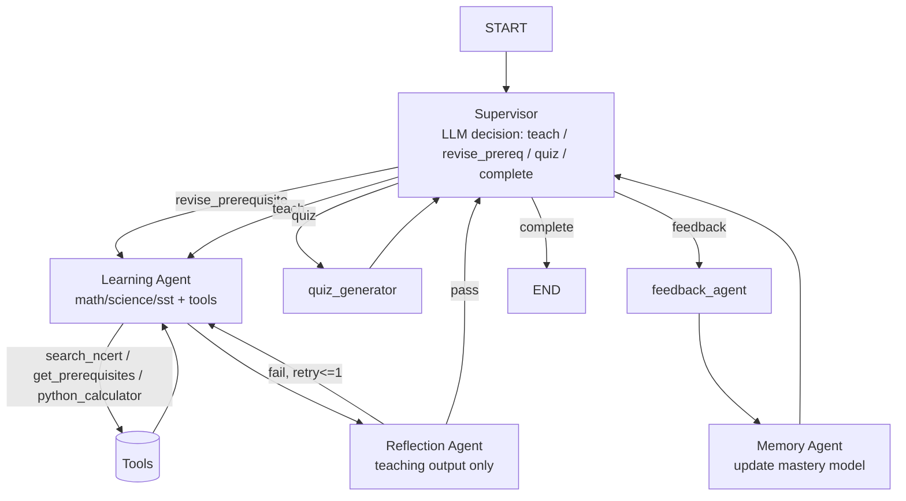

# TeacherJi — Master Phased Revamp Plan

> Synthesizes `plan.md` (evaluation + phase structure) and `archie.md` (target agentic architecture), locked to the decisions made on 2026-07-20:
> - **Supervisor**: LLM-driven decision node (not rule-based), using a small/fast model for cost control.
> - **Reflection**: gates teaching output only, not quiz/feedback — caps the extra-LLM-call cost.
> - **Phase 1 tools**: `search_ncert`, `get_prerequisites`, `python_calculator` (diagram generation deferred).
> - **Auth**: Clerk. **UI**: chat panel added alongside existing card UI, not a rewrite. **Backend host**: Hugging Face Spaces (Render's 512MB limit is already the cause of the current broken deploy).
> - **Priority**: the agentic core (Phase 1 below) ships before auth/polish — it's the thing that changes the project's grade, everything else is packaging.

Every phase ends with something deployed and working — never a half-migrated state.

---

## Phase 0 — Stabilize the Free Deployment ✅ DONE (2026-07-21)
*Goal: stop fighting infra before touching architecture. Current Render deploy already exceeded memory — fix the foundation first.*

Live on Hugging Face Spaces (Docker) + Vercel, confirmed working. Cleanup while closing out: removed the stale duplicate `backend/Dockerfile` (root `Dockerfile` is the one HF Spaces actually builds), and fixed `.gitignore` (was UTF-16 encoded, which is why the `*.docx` rule had rendered as garbled spaced-out characters — rewritten as plain UTF-8 with the rule corrected).

- Move backend hosting from Render → **Hugging Face Spaces (Docker SDK)**. Free CPU-basic tier gives materially more headroom than Render's 512MB, which is what triggered the HF-embeddings detour in the first place.
- Add a `Dockerfile` for the Spaces build; confirm FAISS index artifacts (`rag/index/*.faiss`, `*_meta.json`) are either committed or rebuilt on container start — don't let ingestion be a manual local-only step the deployed container can't reproduce.
- Keep embeddings on the remote HF Inference `feature_extraction` path (already decided against loading a local model — correct call under a memory-constrained free host).
- Repo hygiene: remove `myenv/` and `dist/` from git, add to `.gitignore`; pin all versions in `requirements.txt`; complete `.env.example`.
- Frontend stays on Vercel free, `VITE_API_URL` pointed at the new Spaces URL.

**Deployable after this phase:** identical functionality to today, just running reliably on the intended free stack.

---

## Phase 1 — The True Agentic Core (highest priority, ~5-7 days)
*Goal: this is the phase that actually changes the project's grade. Everything else is packaging around this.*

### 1A. Supervisor node (replaces the if/else router) ✅ DONE (2026-07-25)

The LLM decision node (`agents/supervisor.py:supervisor_node`, `llama-3.1-8b-instant`) predates this log entry — it was already live when 1B started. What was missing until now was the `revise_prerequisite` action from the original spec, which needed 1C's prerequisite map and a Memory-model-aware eligibility check to mean anything; it's now wired in.

`_prerequisite_summary(state)` looks up `api/prerequisites.get_prerequisites(subject, topic)` for the current topic and annotates each prerequisite with this student's mastery (from the Phase 1B Memory model) and whether it's already been revised this session (`state["revised_prerequisites"]`), feeding it to the Supervisor as `prerequisites_for_current_topic` in `_state_summary`. The Supervisor may choose `"revise_prerequisite"` with a `target_topic`, but that choice is never trusted blindly: `_eligible_prerequisite_topics` computes the actual set of valid redirect targets (known numeric mastery below 0.5, not already revised this session) and `supervisor_node` silently downgrades to `"teach"` if the LLM's chosen target isn't in that set — covers a hallucinated topic, an unassessed ("unknown") prerequisite, an already-revised one, or a document-upload session (no curriculum, no prerequisites, always downgraded). `route_from_supervisor` sends `"revise_prerequisite"` to the same subject-agent node as `"teach"`; `subject_agents.py:_run_subject_agent` reads `target_topic` instead of `topic` when redirected, teaches that instead, and appends it to `revised_prerequisites` so the same turn's redirect can't loop.

`reflect_retry` from the original spec was deliberately **not** added as a Supervisor action — Phase 1D superseded it with a simpler design: the bounded retry is a graph-edge loop internal to the Reflection Agent (`route_from_reflection`), not a decision the Supervisor makes each turn.

One non-obvious fix this required: `target_topic` was being returned by `supervisor_node` since 1A originally shipped but was **never declared in the `LearningState` TypedDict** (`agents/state.py`) — LangGraph only persists schema-declared keys across graph steps, so it was silently evaporating by the time a later node read it back. Harmless before (nothing depended on it surviving), but it broke `revise_prerequisite` outright until caught by a mocked-graph test and fixed by adding `target_topic: str` to the schema.

A second correctness gap surfaced in the API layer: `session.py`'s responses and topic-progression bookkeeping (`start_session`/`next_topic`/`_reteach_current_topic`) always assumed the topic taught this turn was the one requested. A redirect breaks that assumption twice over - the response would mislabel a Division refresher as "Fractions," and marking the *requested* topic "covered" would silently skip ever actually teaching it. Fixed with `_was_redirected_to_prerequisite`/`_actually_taught_topic`/`_covered_topics_for_state` in `session.py`, which compare `target_topic` against the requested topic rather than checking `next_action` (which is overwritten to `"complete"` as the turn's terminal action by the time the graph returns, regardless of whether a redirect happened mid-turn - not a usable signal from the API layer).

Verified with mocked-Groq tests: a confirmed low-mastery, not-yet-revised prerequisite triggers the redirect, gets taught, and is recorded; a repeat request in the same session does not loop back into it; a hallucinated topic, an unassessed prerequisite, and a document-upload session all correctly fall back to plain "teach" rather than trusting the LLM's choice.

Original spec:
- Input: current `LearningState` + the student's Memory model (1B) + relevant prerequisite edges (1C).
- Output: strict JSON — `{"next_action": "teach" | "revise_prerequisite" | "quiz" | "reflect_retry" | "complete", "target_topic": str, "reasoning": str}`.

### 1B. Memory Agent (fixes "each session starts fresh") ✅ DONE (2026-07-22)

Built. `students.profile` now holds the structured model below instead of subject-keyed dicts. Rolling EMA updates fire after every `feedback_agent` call (quiz correctness) *and* every re-explanation request (`/session/explain-differently`) — both push mastery/confidence, not just session-end scoring. Loaded once in `/session/start` and carried in `LearningState` for the rest of the session; the Supervisor's state summary and every Learning Agent prompt (math/science/sst/document tutor) now see it and are told to slow down when a topic's mastery is low. Verified against real Postgres: wrote and ran a throwaway script exercising correct → wrong → re-explain → reload, confirmed the values round-trip through the JSONB column exactly.

Known gaps, carried forward: `quiz_generator` still only looks at this session's `weak_topics`, not the persistent `mastery`/`revision_due` maps; `learning_style` has no signal source yet (stuck at the "text" default); the frontend results page still shows placeholder mastery percentages — wiring it to real data is explicitly Phase 3's job per the plan below.

The `students` Postgres table already exists (`profile JSONB`) but is only written at session end and never meaningfully shapes a new session. Upgrade it to the structured model `archie.md` specifies:

```json
{
  "learning_style": "visual",
  "mastery": {"division": 0.42, "fractions": 0.81},
  "weak_topics": ["division"],
  "revision_due": ["fractions"],
  "confidence": {"division": 0.39, "fractions": 0.84}
}
```

- Computed/updated after every `feedback_agent` call (mastery is a rolling function of quiz correctness + re-explanation requests), not just at session end.
- Loaded once at `session/start` and injected into every Supervisor and Learning Agent prompt for that session — this is what makes "student previously struggled with Division" actually change behavior instead of just being logged.

### 1C. Tools for the Learning Agent ✅ DONE (2026-07-25)

Built with Groq native tool-calling (`tools=`/`tool_calls`, OpenAI-compatible surface), not a LangGraph `ToolNode` — the codebase already used the raw `groq` SDK everywhere with no LangChain abstractions in active use, so that was the consistent lift. `math_agent`/`science_agent`/`sst_agent` now run a bounded tool-calling loop (`agents/subject_agents.py:_run_subject_agent`, capped at `MAX_TOOL_ITERATIONS = 4`) instead of retrieving unconditionally before the only Groq call: the model sees all three tools up front and decides whether/when to call each, with `tool_choice="auto"` while tools are still in play and a forced `tool_choice="none"` pass to close out the final JSON answer. The old eager "one retrieval + fallback without chapter filter" logic moved *inside* `search_ncert` itself (`agents/tools.py`), so the agent still gets that fallback for free on a single call. A grounding guarantee is enforced after the loop, not just trusted to the prompt: if no `search_ncert` call ever returned a chunk, the teaching output is replaced with the existing canned "NCERT context not found" response regardless of what the model produced — this covers a model that skips the tool despite being told to call it.

`get_prerequisites(topic)` is backed by a new static map, `api/prerequisites.py` (mirrors `curriculum.py`'s plain-nested-dict convention, same case-insensitive/substring lookup style), covering the topics that actually exist in `NCERT_CURRICULUM` across math/science/sst plus a few canonical aliases (e.g. "percentages") a student might name directly. `python_calculator(expression)` is an AST-walking evaluator (`agents/tools.py:_eval_node`) whitelisting only numeric constants, `+ - * / // % **`, unary +/-, and `abs/round/min/max/sqrt` calls — verified it rejects `__import__(...)`-style injection attempts and handles division-by-zero without raising.

Known gaps, carried forward: tools aren't independently traceable as LangGraph nodes/edges, only as an in-node loop, so Phase 4's LangSmith tracing will see them as nested tool-call messages rather than graph steps unless that's revisited; no automated tests were added (repo still has zero pytest — verification here was manual: unit-checked the calculator/prerequisite lookups directly, then confirmed the tool-calling loop actually round-trips against the live Groq API and a real FAISS index, though the final live run hit an expired `GROQ_API_KEY` in `.env` rather than a code issue). (The Supervisor not branching on `get_prerequisites` was also listed here originally — that's now closed, see 1A above.)

Previously `math_agent`/`science_agent`/`sst_agent` always did one fixed retrieval + one Groq call — no decision was ever made about *how* to answer. Give them real tool choice (Groq tool-calling or a LangGraph `ToolNode`):

| Tool | What it does | Notes |
|---|---|---|
| `search_ncert(query, chapter?)` | Wraps the existing `retriever.retrieve()` — but now the agent *chooses* to call it rather than it running unconditionally | Smallest lift — mostly a signature change |
| `get_prerequisites(topic)` | Returns prerequisite topics from a curriculum dependency map | **Real content work**: build a small static JSON map per subject/grade (e.g. `division → fractions → decimals → percentages` for math 6-8). This is the single highest-impact addition — it's what lets the Supervisor produce the "teach Division before Fractions" flow that's the centerpiece example in `archie.md` |
| `python_calculator(expression)` | Verifies a computed numeric answer before the math agent presents it | Use a restricted AST-based evaluator, not `eval()` — don't introduce an injection surface for the sake of a demo feature |

*(`generate_diagram` deferred to a later phase — lower interview impact than the three above, per your call.)*

### 1D. Reflection Agent — teaching output only ✅ DONE (2026-07-25)

Built as a new graph node, `agents/reflection.py:reflection_agent`, sitting between the subject agents and the Supervisor (`math_agent`/`science_agent`/`sst_agent` → `reflection_agent` → Supervisor, per the mermaid diagram below). Uses `llama-3.1-8b-instant` (`REFLECTION_MODEL`) with a dedicated `REFLECTION_PROMPT` (`agents/prompts.py`) that checks all three things the plan called for — grounded in `retrieved_context`, curriculum-appropriate for the grade, and paced right per the student's Memory model — and returns `{"passed", "grounded", "curriculum_appropriate", "right_difficulty", "critique"}`.

On failure, `route_from_reflection` routes back to whichever subject agent produced the output (tracked via a new `teaching_agent` state field) exactly once — `reflection_retry_count` caps it, and the critique is appended as an extra user turn in `_run_subject_agent`'s conversation (`agents/subject_agents.py`) so the retried agent sees exactly what to fix, tools included (it may call `search_ncert`/`get_prerequisites`/`python_calculator` again on the retry). A second failure is accepted anyway rather than looping — verified with a mocked-Groq test that reflection is called exactly twice and the graph still terminates cleanly. Quiz generation and feedback scoring skip reflection entirely, as decided — `quiz_generator`/`feedback_agent`/`document_tutor` route straight to the Supervisor, unchanged.

Two deliberate guardrails beyond the plan's literal wording: (1) if `retrieved_context` is empty (the subject agent's canned "NCERT context not found" safety response, from 1C), reflection is skipped entirely with zero LLM calls — there's nothing real to audit and no point spending a call on it; (2) if the reflection call itself throws (bad JSON, API error), it fails open and accepts the teaching output rather than blocking the turn — reflection is a quality gate, not a hard dependency. Verified all three paths (retry-then-accept, no-context skip, fail-twice force-accept) with a mocked Groq client, since the actual `GROQ_API_KEY` in `.env` is currently expired.

Known gap, carried forward: `document_tutor` (the generic uploaded-document tutor) intentionally does not go through reflection — the plan's language and diagram both scope this to the three NCERT subject agents, so it was left on its original eager-retrieval path from before 1C.

Original spec:
- After a subject agent produces `teaching_output`, one cheap `llama-3.1-8b-instant` call checks: is this grounded in the retrieved chunks, curriculum-appropriate for the grade, and at the right difficulty per the student's Memory model?
- Fail → one bounded retry of the subject agent with the critique appended to the prompt. No infinite loop; cap at 1 retry to control latency/cost.
- Quiz generation and feedback scoring **skip** reflection — this halves the extra-call cost relative to reflecting everything, per your decision.

### New graph shape



**Deployable after this phase:** same UI as today, but sessions now visibly behave differently — a student weak in Division gets redirected to a refresher before Fractions, quiz difficulty shifts with mastery, math answers are calculator-verified, and reasoning is inspectable. This is the demo moment for interviews — record it.

**Cost guardrail:** Supervisor + Reflection both on `8b-instant`, only the actual teaching/quiz generation stays on `70b-versatile`. Log token counts per session before shipping to sanity-check against Groq's free-tier rate limits.

---

## Phase 2 — Auth & Professional Foundation (~2-3 days) ✅ DONE (2026-07-28)

- **Clerk** integration (already decided): replace the `student-${random}` localStorage ID with Clerk-authenticated users; verify Clerk JWTs in FastAPI middleware; map Clerk `user_id` → `students.student_id`.
- **README overhaul**: move the raw dev-journal section into a linked `ENGINEERING_LOG.md` (it's good evidence of debugging skill — just not the first thing a recruiter should see). Add: problem statement, screenshots/demo link, a "Key Design Decisions" section that explicitly walks through the Supervisor → Learning Agent → Memory → Reflection loop from Phase 1, and a "Limitations & Future Work" section.
- Repo hygiene finish: `.env.example` gets Clerk keys; Pydantic validation audit; React error boundary; consistent HTTP error responses.

**Deployable after this phase:** real accounts, a README that actually sells the architecture instead of hiding it.

---

## Phase 3 — Chat Panel + Streaming (~3-4 days) ✅ DONE (2026-07-28)

Executed after Phase 4 (Observability & Evaluation), not before — Phase 4's three sub-parts were independent of this one, and Phase 4 was requested first.

### 3A. Progress dashboard wired to real mastery data

`ResultsPage.tsx`'s "Topic mastery" section was rendering a fake formula (`weakTopics.includes(topic) ? 42 : masteredTopics.includes(topic) ? 90 : 65`) instead of anything from the Phase 1B Memory model - exactly the gap flagged as "explicitly Phase 3's job" back in 1B's own changelog entry. Worse: `GET /student/{student_id}` already returned the real per-concept `mastery` map (`api/routes/student.py`, live since Phase 1B), but the frontend's `StudentProfile` TypeScript type didn't match it at all (`topics_mastered: Record<string, string[]>` - a shape the backend has never actually returned) and there was no `apiClient` method to call the endpoint in the first place. Fixed both: `client.ts`'s `StudentProfile` now mirrors `api/models.py`'s Pydantic model field-for-field, `apiClient.getStudentProfile()` added, and `ResultsPage.tsx` fetches it via `useQuery` (refetching once the end-of-session `persistResults` mutation settles, so the bars reflect this session's rollup) and renders real `mastery[topic]` percentages with a loading state for the gap before the first fetch resolves.

### 3B. SSE streaming for the teaching-generation step

Real token-level streaming, not a simulated typing effect: `agents/subject_agents.py` adds a `stream_sink` `ContextVar[Callable[[str], None] | None]` that the shared Groq call helpers (`call_groq_with_retry`'s nested `_completion`, and `_create_completion` - the tool-calling loop's completion helper) consult before deciding whether to call Groq with `stream=True` and forward content deltas, or call it normally. Default `None` means every existing call path (Supervisor, Reflection, quiz, feedback) is provably unaffected - verified by mocked tests confirming `call_groq_with_retry` never streams unless a caller explicitly passes the new `allow_streaming=True` (only `document_tutor` does), while `_create_completion` streams automatically once a sink is active, since every one of its call sites is already the teaching-generation path by construction. A `_stream_chat_completion` helper consumes the Groq stream and reconstructs a normal-shaped `.choices[0].message` object (`.content`/`.tool_calls`) so none of `_run_subject_agent`'s existing tool-calling-loop logic needed to change.

Chose a `ContextVar` over threading a callback through every function signature, or a new `LearningState` field, specifically because `api/routes/session.py`'s `_sse_teaching_stream` sets it around a `run_session()` call that executes in a worker thread (`threading.Thread`, not `asyncio.to_thread`, so the queue-draining generator and the graph invocation actually run concurrently) - and Python's context-copying rules mean a `ContextVar` set in the calling context is *not* automatically visible in a plain `threading.Thread` target the way it is with `asyncio.to_thread`'s implicit `contextvars.copy_context()`. Handled by having the worker thread itself call `stream_sink.set(...)` at its own top, inside the thread - simpler than fighting context propagation, and avoids ever putting a non-JSON-serializable callback into `LearningState`, which `save_session` would `json.dumps` and crash on.

Four new SSE routes mirror the existing ones exactly in shape (`/session/start/stream`, `/session/next-topic/stream`, `/session/question/stream`, `/session/explain-differently/stream`): each emits `token` events as text streams in, then one `done` event carrying the identical JSON payload its non-streaming twin returns (built by a shared `_teaching_response_payload` helper), or an `error` event on failure - verified end-to-end with a `TestClient.stream()` call over the real ASGI app (mocked Groq/DB) confirming status 200, `text/event-stream` content type, and correctly-ordered SSE frames. `next-topic/stream`'s chapter-complete branch never touches the teaching agent at all, so it just emits one immediate `done` event with no tokens - correctly cheaper than its own non-streaming twin would suggest.

**Two real bugs found only by testing this live in a browser** (not by the mocked tests, which used clean fixtures):
1. A mid-stream Groq error (the already-documented "malformed function-call token" quirk from Phase 1C, e.g. `<function=search_ncert {...}>`) raises `groq.APIError` - the *base* exception class - not `RateLimitError`/`APIStatusError`, which is what every retry `except` clause in `subject_agents.py` was narrowed to. Non-streaming calls never surfaced this because Groq's non-streaming 400 responses map to `APIStatusError`; the same failure mid-*stream* is raised differently by the SDK (confirmed by reading `groq/_streaming.py`: `Stream.__stream__` raises plain `APIError` on an embedded error frame). Widened all three `except` clauses to `APIError` - a strict superset, so this also makes the existing retry logic correctly handle `APIConnectionError`/`APITimeoutError` now, not just the two cases it accidentally covered before.
2. Once (1) was fixed, live testing surfaced a second, streaming-specific issue: when the model emits that same malformed tool call as literal text content instead of a proper `tool_calls` delta, the old code forwarded every content delta to the sink unconditionally - so the user would briefly see raw internal text like `search_ncert(query="...", chapter="...")` typed out in the chat panel before the turn got silently retried. Non-streaming callers never showed this because they only look at the fully-assembled `.content` after the fact (and discard it once `json.loads` fails). Fixed by buffering the first ~40 characters of any streamed message before forwarding anything, classifying that prefix against the known tool names (`_MALFORMED_TOOL_CALL_PREFIX`, covering both the bare `search_ncert(...)` and `<function=search_ncert {...}>` forms actually observed), and suppressing the live forward entirely for a match while still keeping it in the reconstructed `.content` the existing recovery logic already knows how to handle. Verified with unit tests against all three shapes (bare malformed call, wrapped malformed call, legitimate JSON) before re-verifying live.

### 3C. Chat panel

`ChatPanel.tsx`, placed alongside (not replacing) `TeachingCard` in a two-column layout on `TeachingPage`. Sends follow-ups through `/session/question/stream` - the same Supervisor/Learning Agent loop every other teaching action already used, just with a conversational UI instead of the old toggle-a-textarea pattern (removed, since the chat panel now covers that same job better). Streams the assistant bubble's raw text live as tokens arrive, then swaps to a clean `headline` + `explanation` rendering once the `done` event lands and the turn's full `teaching_output` is known - and applies the same `setSession` update the old non-streaming handler did, so the main `TeachingCard` stays in sync with whatever the chat turn actually taught (including a Supervisor-redirected prerequisite refresher, same as before). "Next topic" and "Explain differently" were also switched to their streaming twins, showing a live raw-JSON preview banner ("Teaching the next topic...", "Rebuilding the explanation...") while the request is in flight, then swapping to the normal structured card - chosen over trying to incrementally parse partial JSON into the structured fields, which would have added real complexity for a cosmetic improvement over "show the raw stream, then swap."

### 3D. Markdown + KaTeX rendering

Added `react-markdown`/`remark-gfm`/`remark-math`/`rehype-katex`/`katex`. A shared `Markdown.tsx` wrapper replaces plain `<p>`/`<pre>` rendering for every teaching-output text field that can plausibly contain real content (explanation steps, analogy, examples, key points, common mistakes, diagram descriptions) and the chat panel's assistant bubbles - so if a subject agent's prompt output ever includes real notation (`$\frac{1}{2}$`) or basic Markdown, it renders instead of showing literal syntax. `katex/dist/katex.min.css` imported once in `main.tsx`. Confirmed `npm run build` still succeeds (adds ~900KB of KaTeX font assets, one chunk-size warning, not addressed - out of scope for this phase).

**Verification:** `tsc -b --force` and `npm run build` clean throughout. Backend: mocked unit tests for every new streaming code path (accumulator with content-only/tool-call chunks, `allow_streaming` gating, malformed-content suppression) plus a real `TestClient.stream()` run over the full ASGI app. Frontend: driven live in a real signed-in browser session (Clerk auth blocks fully automated E2E, so the user signed in and handed off) - started a real session, asked a follow-up in the chat panel, clicked "Explain differently," watched tokens stream live from the real Groq API and swap into the settled card after a real Reflection-Agent pass, confirmed no leaked internal text and no console errors. This is also how both bugs above were actually found.

**Deployable after this phase:** streaming chat UX layered onto the agentic core.

---

## Phase 4 — Observability & Evaluation (~2-3 days) ✅ DONE (2026-07-28)

Executed ahead of Phase 3 (Chat Panel + Streaming) - all three sub-parts here were independent of the chat/streaming UI work, so there was no reason to block on it.

### 4A. LangSmith tracing

Zero-code-change graph-level tracing: `agents/graph.py`'s `app` is a compiled `StateGraph`, and LangGraph nodes are `Runnable`s under the hood, so `langchain_core`'s callback machinery auto-attaches a `LangChainTracer` to every node once `LANGSMITH_TRACING=true` is read from the environment (via `langsmith.utils.get_env_var`, which checks both `LANGSMITH_*` and legacy `LANGCHAIN_*` namespaces) — no explicit callback wiring needed. What *did* need explicit instrumentation: the raw `groq` SDK calls, since they're plain HTTP calls with no LangChain wrapper and would otherwise show up as opaque time inside a node's span. `agents/subject_agents.py:call_groq_with_retry` (shared by every agent that isn't doing tool-calling — reflection/supervisor/quiz/feedback/document_tutor) and `_create_completion` (the tool-calling path used by math/science/sst agents) are both wrapped with `@traceable(run_type="llm", ...)`. `call_groq_with_retry` nests the traced call inside itself so the `client` object (not JSON-serializable) never enters the traced inputs — only `model` and `messages` do, which is also what let LangSmith's OpenAI-shape usage detection pick up Groq's `usage` field for free (same response schema). `agents/tools.py`'s three tools (`search_ncert`, `get_prerequisites`, `python_calculator`) are each wrapped with `@traceable(run_type="tool", ...)` individually (not the `execute_tool_call` dispatcher, which takes a non-serializable Groq `tool_call` object) — this is what makes the "agent chooses to look up prerequisites, decides to redirect" story actually visible as a tool span in the trace, not just inferred from the final JSON.

`agents/graph.py:run_session` now builds a `RunnableConfig` (`_trace_config`) tagging every turn with `subject:`/`mode:` and `metadata={session_id, student_id, subject, grade, chapter, topic}`, so traces are filterable per-student/per-session in the LangSmith UI. This needed `session_id` to actually exist in `LearningState` — it was declared in the TypedDict since Phase 1 but never populated (`api/routes/session.py:start_session` built `initial_state` without it); added `"session_id": session_id` to that dict, and since LangGraph persists unreturned keys unchanged across the whole invocation and `save_session`/`load_session` round-trip the full state through Redis, every later turn (`quiz.py`, `next_topic`, re-explain) inherits it for free.

Verified with a mocked `Groq` client: `call_groq_with_retry` produces identical output whether tracing is on or off, and with `LANGSMITH_TRACING=true` + a deliberately invalid API key, a failed trace upload logs a warning but never raises or affects the returned result — tracing is fail-open, matching the "quality signal, not a hard dependency" posture the codebase already uses for Reflection (Phase 1D).

### 4B. Evaluation scripts (`backend/eval/`)

Two scripts, both runnable standalone (`python -m eval.rag_eval`, `python -m eval.reflection_eval`) and both hitting real infrastructure (the live FAISS indexes + HF embeddings API + Groq), not mocks:

- **`rag_eval.py`** — 15 hand-written question/expected-keyword pairs (`rag_eval_set.json`, 5 per subject across the three ingested class6 indexes) scored by keyword recall against `rag.retriever.retrieve`'s actual top-k output. Deliberately does not filter by chapter: `search_ncert` already falls back to an unfiltered subject/grade search when a chapter-scoped one is empty, and the ingested `chapter_title` metadata turned out to be inconsistent across subjects while building this (science's chunks carry no `chapter_num` at all, unlike math/sst) — scoring the unfiltered path is what the system actually falls back to in production, so it's the fairer thing to measure, and chapter-based scoring was dropped as unreliable given that data-quality gap rather than silently faked. Result: 15/15 items pass the 50%-recall threshold, 98% average keyword recall.
- **`reflection_eval.py`** — answers master_plan's "evaluate Reflection Agent precision against a seeded set of known-bad outputs" directly, and doubles as the RAG "answer faithfulness" check (the Reflection Agent's own `grounded` check *is* a faithfulness judge). 8 hand-written `teaching_output` payloads (4 expected to pass, 4 seeded with a specific defect — ungrounded fabrication x2, curriculum-inappropriate jargon, under-scaffolded for a flagged-weak student) run through the exact same prompt template and model reflection.py uses, against real retrieved context for Fractions/Magnets. First real run: **recall 100%, precision 50%** (confusion matrix TP=4 FP=4 FN=0 TN=0) — it caught every seeded defect, but also rejected all 4 good examples. Read the critiques: the grounded check is stricter than the prompt intends, rejecting a faithful paraphrase ("push apart" for a context that says "repel") as unsupported, and the difficulty check demands extra scaffolding even for a student with *no* mastery data at all, not just a confirmed low-mastery one. This is a real calibration gap in `REFLECTION_PROMPT`, not a bug in the eval — carried forward as a known gap rather than patched here, since fixing agent behavior is Phase 1D's scope, not Phase 4's; the eval's job was to surface it, and it did.

### 4C. Prompt versioning

`agents/prompt_registry.py` wraps every template already in `prompts.py` (unchanged — no reason to move working prompt strings into YAML for a single-developer project) in a `PromptEntry(name, version, template)`, all currently version 1. `render_versioned(name, **values)` replaces direct `render_prompt(TEMPLATE, ...)` calls at every call site (`subject_agents.py`, `document_agent.py`, `quiz_agent.py`, `reflection.py`, `supervisor.py`) and returns `(rendered_text, version)`. The version threads through to `call_groq_with_retry`'s new `prompt_name`/`prompt_version` parameters (added to its signature, tagged onto the traced call's metadata) and, for the tool-calling path, through `_run_subject_agent` into `_create_completion`/`_finalize_json` via LangSmith's `langsmith_extra={"metadata": {...}}` per-call override — so every LLM call's trace answers "which prompt version produced this" directly, closing the loop with 4A. Bumping a template's behavior (not just fixing a typo) is what should bump the version number here going forward.

Verified with mocked Groq clients: `math_agent`'s full tool-calling loop, `supervisor_node`, and `reflection_agent` all still produce identical output post-refactor.

**Deployable after this phase:** inspectable traces (tag/filter by session, subject, prompt version) + two runnable evaluation scripts with real, reproducible numbers — including one that already found something worth fixing.

---

## Phase 5 — Polish & Portfolio (~2-3 days) ✅ DONE (2026-07-28)

### 5A. Tests + CI

The repo had zero pytest infrastructure before this (`backend/test_db.py`/`test_groq.py` and `rag/test_retriever.py` are manual scripts with a `__main__` block, not pytest). Added `backend/pytest.ini` (`pythonpath = .`, `testpaths = tests`), `backend/requirements-dev.txt`, and `backend/tests/`: `test_supervisor.py` (deterministic routing, `_eligible_prerequisite_topics`, the LLM decision path including the ineligible-target-rejection guardrail, and `route_from_supervisor`), `test_tools.py` (`python_calculator`'s AST whitelist against both valid expressions and injection attempts, `search_ncert`'s chapter-scoped-empty fallback, `execute_tool_call`'s dispatch/error-handling), `test_reflection.py` (skip-when-no-context, pass, retry-once, force-accept-after-budget-spent, fail-open-on-exception), and `test_graph_integration.py` — a real integration test driving `agents/graph.py:run_session` end to end through both the teach→reflect→complete loop and the quiz→complete loop, with Groq mocked only at the `call_groq_with_retry`/`_create_completion` module boundaries each agent already imports through (not a re-mock of the unit tests above - this exercises the actual graph wiring and routing).

All 64 tests run against a mocked Groq client (a dummy `GROQ_API_KEY` is set in `tests/conftest.py` before any `agents.*` module imports, since the module-level `Groq(api_key=...)` client construction raises immediately without one) - zero live API calls, runs in ~1-2s. `.github/workflows/ci.yml` runs `pytest` (backend) and `npm run build` (frontend, which includes `tsc -b`) on every push/PR to `main`. The Makefile's `test` target now runs pytest; the pre-existing live-server smoke test moved to `test-e2e` unchanged.

### 5B. UI pass — dark mode, mobile responsiveness, honest loading copy

Dark mode is class-based (`tailwind.config.cjs`: `darkMode: "class"`), not media-query-only, so it's a user choice rather than just following the OS - `src/theme.ts` resolves an initial theme (stored preference, falling back to OS preference) and applies it before the first render (in `main.tsx`, ahead of `ReactDOM.createRoot`) to avoid a light-mode flash; `ThemeToggle.tsx` is mounted once, globally, in `main.tsx` outside both the signed-in and signed-out branches, so it's available everywhere. Every page and shared component (`Sidebar`, `TeachingCard`, `ChatPanel`, `QuizCard`, `FeedbackPanel`, `GuidingQuestion`, `Markdown`, `ErrorBoundary`, and the subject-accent colors in `data/curriculum.ts`) got `dark:` variants for backgrounds/borders/text - verified live in a real browser (both themes, per-color-section) rather than just by reading the Tailwind classes, since `dark:` variants are exactly the kind of thing that looks right in source and wrong on screen.

Mobile responsiveness had one real layout bug: `Sidebar.tsx` was a fixed `w-[280px] h-screen` column and `TeachingPage.tsx`'s wrapper was a bare `flex` (row) with no breakpoint - on a narrow viewport this would either overflow horizontally or crush the teaching card into a sliver next to a fixed-width sidebar. Fixed by making the sidebar `w-full` with a `border-b` (stacked on top) below the `lg` breakpoint and only becoming a fixed-width bordered-right column at `lg:`, and making the page wrapper `flex-col lg:flex-row`. The chat panel's height was also a flat `h-[calc(100vh-6rem)]` regardless of viewport, which would render as an oddly tall, mostly-empty box when stacked under the teaching card on mobile - capped to `h-[70vh]` below `lg:`, full sticky height only at `lg:` and above.

Loading copy: `SelectionPage`'s "Start Learning" button used to just say "Starting session..." for the entire duration of a Supervisor decision → tool-calling loop → Reflection pass. Added `useStagedLoadingLabel` (`src/hooks/`), which cycles through real pipeline-stage copy ("Checking what you already know…" → "Deciding what to teach first…" → "Looking up the textbook…" → "Verifying the explanation…") on a timer while the request is in flight - honest framing of the actual stages (session/start isn't an SSE route, so there's no real per-stage signal to key off), not a fake progress bar. `TeachingPage`'s streaming-preview banners (from Phase 3B/3C) and `QuizPage`'s "Preparing your quiz..." copy were already reasonably honest and left as-is.

### 5C. Landing page

The app previously showed a bare `<SignIn/>` widget with no context when signed out (`main.tsx`'s `Show when="signed-out"` branch). Replaced with `pages/LandingPage.tsx`: hero copy explaining what makes this different from a scripted RAG pipeline, the two real screenshots (`docs/screenshots/`, copied into `frontend/public/screenshots/` so Vite can serve them) instead of a fabricated demo video/GIF neither of which exist, a hand-rolled architecture flow (Supervisor → Learning Agent → Reflection → Memory, responsive - stacked with connecting lines on mobile, side-by-side with arrows at `lg:`) rather than pulling in a diagram library for four boxes, a feature grid, and a "Try it free" CTA that smooth-scrolls to an embedded `<SignIn/>` widget rather than guessing at a modal-trigger API shape. Fully dark-mode-aware and responsive from the start, verified live (both themes) since it's the one page a first-time visitor unconditionally sees.

### 5D. ADRs + contributing guide

`docs/adr/` records the four Phase 1 architecture decisions that actually shaped the project's grade - LLM-driven Supervisor over if/else routing (0001), Reflection scoped to teaching output only (0002), native Groq tool-calling over a LangGraph `ToolNode` (0003), and the structured persistent Memory model (0004) - each with context, the decision, alternatives considered and why they were rejected, and consequences (including the gaps each decision knowingly left open, e.g. Reflection's measured 50% precision from the Phase 4B eval). `CONTRIBUTING.md` covers project layout, local setup, the mocked-Groq test-writing pattern established in 5A, and when to add a new ADR vs. extend `master_plan.md`'s phase changelog. `README.md`'s Limitations & Future Work section was also corrected - several items it listed (no tests, no streaming, tools not traceable) were already resolved by Phases 3/4/5 but the doc hadn't caught up; replaced with the gaps that are actually still open.

**Deployable after this phase:** portfolio-ready, interview-ready.

---

## Free Deployment Stack (final)

| Component | Free Option | Notes |
|---|---|---|
| Frontend | Vercel | unchanged |
| Backend | **Hugging Face Spaces (Docker)** | replaces Render — fixes the memory-limit issue from the dev log |
| Postgres | NeonDB | unchanged, now also holds the structured Memory model |
| Redis | Upstash | unchanged, session-scoped state only |
| LLM | Groq | `8b-instant` for Supervisor/Reflection, `70b-versatile` for teaching/quiz |
| Auth | Clerk | per your decision |
| Observability | LangSmith (free tier) | pairs natively with LangGraph |
| Embeddings | HuggingFace Inference | unchanged — correct call to avoid loading a local model on a memory-constrained host |

---

## Why Phase 1 is the fulcrum

Phases 0 and 2-5 are packaging: hosting, accounts, UX, and polish that any well-built RAG app needs. Phase 1 is the only phase that changes what this project *is* — from a deterministic pipeline with an LLM at the end, to a system where a model plans the next action, chooses tools, checks its own output, and adapts using persistent memory. That's the difference between a 5/10 and an 8+/10 in an interview, and it's why it's sequenced first.
