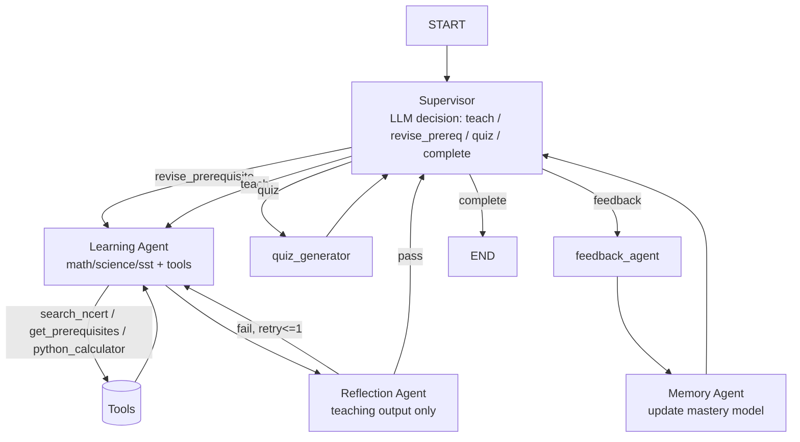

# TeacherJi — Master Phased Revamp Plan

> Synthesizes `plan.md` (evaluation + phase structure) and `archie.md` (target agentic architecture), locked to the decisions made on 2026-07-20:
> - **Supervisor**: LLM-driven decision node (not rule-based), using a small/fast model for cost control.
> - **Reflection**: gates teaching output only, not quiz/feedback — caps the extra-LLM-call cost.
> - **Phase 1 tools**: `search_ncert`, `get_prerequisites`, `python_calculator` (diagram generation deferred).
> - **Auth**: Clerk. **UI**: chat panel added alongside existing card UI, not a rewrite. **Backend host**: Hugging Face Spaces (Render's 512MB limit is already the cause of the current broken deploy).
> - **Priority**: the agentic core (Phase 1 below) ships before auth/polish — it's the thing that changes the project's grade, everything else is packaging.

Every phase ends with something deployed and working — never a half-migrated state.

---

## Phase 0 — Stabilize the Free Deployment ✅ DONE (2026-07-21)
*Goal: stop fighting infra before touching architecture. Current Render deploy already exceeded memory — fix the foundation first.*

Live on Hugging Face Spaces (Docker) + Vercel, confirmed working. Cleanup while closing out: removed the stale duplicate `backend/Dockerfile` (root `Dockerfile` is the one HF Spaces actually builds), and fixed `.gitignore` (was UTF-16 encoded, which is why the `*.docx` rule had rendered as garbled spaced-out characters — rewritten as plain UTF-8 with the rule corrected).

- Move backend hosting from Render → **Hugging Face Spaces (Docker SDK)**. Free CPU-basic tier gives materially more headroom than Render's 512MB, which is what triggered the HF-embeddings detour in the first place.
- Add a `Dockerfile` for the Spaces build; confirm FAISS index artifacts (`rag/index/*.faiss`, `*_meta.json`) are either committed or rebuilt on container start — don't let ingestion be a manual local-only step the deployed container can't reproduce.
- Keep embeddings on the remote HF Inference `feature_extraction` path (already decided against loading a local model — correct call under a memory-constrained free host).
- Repo hygiene: remove `myenv/` and `dist/` from git, add to `.gitignore`; pin all versions in `requirements.txt`; complete `.env.example`.
- Frontend stays on Vercel free, `VITE_API_URL` pointed at the new Spaces URL.

**Deployable after this phase:** identical functionality to today, just running reliably on the intended free stack.

---

## Phase 1 — The True Agentic Core (highest priority, ~5-7 days)
*Goal: this is the phase that actually changes the project's grade. Everything else is packaging around this.*

### 1A. Supervisor node (replaces the if/else router)

Today, `route_from_orchestrator()` in `orchestrator.py` is pure Python — it never asks a model anything, it just switches on a `mode` string. That's the single biggest reason this reads as "RAG with routing," not agentic AI.

Replace it with an LLM decision node:
- Model: `llama-3.1-8b-instant` (fast/cheap — this call happens on every turn, so it shouldn't be the 70B model).
- Input: current `LearningState` + the student's Memory model (1B below) + relevant prerequisite edges (1C).
- Output: strict JSON — `{"next_action": "teach" | "revise_prerequisite" | "quiz" | "reflect_retry" | "complete", "target_topic": str, "reasoning": str}`.
- `graph.py`'s conditional edges now branch on `next_action` from the Supervisor's *reasoning*, not a client-supplied `mode` string. The mode field becomes an input signal, not the sole router.

### 1B. Memory Agent (fixes "each session starts fresh") ✅ DONE (2026-07-22)

Built. `students.profile` now holds the structured model below instead of subject-keyed dicts. Rolling EMA updates fire after every `feedback_agent` call (quiz correctness) *and* every re-explanation request (`/session/explain-differently`) — both push mastery/confidence, not just session-end scoring. Loaded once in `/session/start` and carried in `LearningState` for the rest of the session; the Supervisor's state summary and every Learning Agent prompt (math/science/sst/document tutor) now see it and are told to slow down when a topic's mastery is low. Verified against real Postgres: wrote and ran a throwaway script exercising correct → wrong → re-explain → reload, confirmed the values round-trip through the JSONB column exactly.

Known gaps, carried forward: `quiz_generator` still only looks at this session's `weak_topics`, not the persistent `mastery`/`revision_due` maps; `learning_style` has no signal source yet (stuck at the "text" default); the frontend results page still shows placeholder mastery percentages — wiring it to real data is explicitly Phase 3's job per the plan below.

The `students` Postgres table already exists (`profile JSONB`) but is only written at session end and never meaningfully shapes a new session. Upgrade it to the structured model `archie.md` specifies:

```json
{
  "learning_style": "visual",
  "mastery": {"division": 0.42, "fractions": 0.81},
  "weak_topics": ["division"],
  "revision_due": ["fractions"],
  "confidence": {"division": 0.39, "fractions": 0.84}
}
```

- Computed/updated after every `feedback_agent` call (mastery is a rolling function of quiz correctness + re-explanation requests), not just at session end.
- Loaded once at `session/start` and injected into every Supervisor and Learning Agent prompt for that session — this is what makes "student previously struggled with Division" actually change behavior instead of just being logged.

### 1C. Tools for the Learning Agent ✅ DONE (2026-07-25)

Built with Groq native tool-calling (`tools=`/`tool_calls`, OpenAI-compatible surface), not a LangGraph `ToolNode` — the codebase already used the raw `groq` SDK everywhere with no LangChain abstractions in active use, so that was the consistent lift. `math_agent`/`science_agent`/`sst_agent` now run a bounded tool-calling loop (`agents/subject_agents.py:_run_subject_agent`, capped at `MAX_TOOL_ITERATIONS = 4`) instead of retrieving unconditionally before the only Groq call: the model sees all three tools up front and decides whether/when to call each, with `tool_choice="auto"` while tools are still in play and a forced `tool_choice="none"` pass to close out the final JSON answer. The old eager "one retrieval + fallback without chapter filter" logic moved *inside* `search_ncert` itself (`agents/tools.py`), so the agent still gets that fallback for free on a single call. A grounding guarantee is enforced after the loop, not just trusted to the prompt: if no `search_ncert` call ever returned a chunk, the teaching output is replaced with the existing canned "NCERT context not found" response regardless of what the model produced — this covers a model that skips the tool despite being told to call it.

`get_prerequisites(topic)` is backed by a new static map, `api/prerequisites.py` (mirrors `curriculum.py`'s plain-nested-dict convention, same case-insensitive/substring lookup style), covering the topics that actually exist in `NCERT_CURRICULUM` across math/science/sst plus a few canonical aliases (e.g. "percentages") a student might name directly. `python_calculator(expression)` is an AST-walking evaluator (`agents/tools.py:_eval_node`) whitelisting only numeric constants, `+ - * / // % **`, unary +/-, and `abs/round/min/max/sqrt` calls — verified it rejects `__import__(...)`-style injection attempts and handles division-by-zero without raising.

Known gaps, carried forward: the Supervisor doesn't yet branch on `get_prerequisites` results (that's Phase 1A's `revise_prerequisite` action, still not wired — the Supervisor prompt still explicitly tells the model not to use it); tools aren't independently traceable as LangGraph nodes/edges, only as an in-node loop, so Phase 4's LangSmith tracing will see them as nested tool-call messages rather than graph steps unless that's revisited; no automated tests were added (repo still has zero pytest — verification here was manual: unit-checked the calculator/prerequisite lookups directly, then confirmed the tool-calling loop actually round-trips against the live Groq API and a real FAISS index, though the final live run hit an expired `GROQ_API_KEY` in `.env` rather than a code issue).

Previously `math_agent`/`science_agent`/`sst_agent` always did one fixed retrieval + one Groq call — no decision was ever made about *how* to answer. Give them real tool choice (Groq tool-calling or a LangGraph `ToolNode`):

| Tool | What it does | Notes |
|---|---|---|
| `search_ncert(query, chapter?)` | Wraps the existing `retriever.retrieve()` — but now the agent *chooses* to call it rather than it running unconditionally | Smallest lift — mostly a signature change |
| `get_prerequisites(topic)` | Returns prerequisite topics from a curriculum dependency map | **Real content work**: build a small static JSON map per subject/grade (e.g. `division → fractions → decimals → percentages` for math 6-8). This is the single highest-impact addition — it's what lets the Supervisor produce the "teach Division before Fractions" flow that's the centerpiece example in `archie.md` |
| `python_calculator(expression)` | Verifies a computed numeric answer before the math agent presents it | Use a restricted AST-based evaluator, not `eval()` — don't introduce an injection surface for the sake of a demo feature |

*(`generate_diagram` deferred to a later phase — lower interview impact than the three above, per your call.)*

### 1D. Reflection Agent — teaching output only ✅ DONE (2026-07-25)

Built as a new graph node, `agents/reflection.py:reflection_agent`, sitting between the subject agents and the Supervisor (`math_agent`/`science_agent`/`sst_agent` → `reflection_agent` → Supervisor, per the mermaid diagram below). Uses `llama-3.1-8b-instant` (`REFLECTION_MODEL`) with a dedicated `REFLECTION_PROMPT` (`agents/prompts.py`) that checks all three things the plan called for — grounded in `retrieved_context`, curriculum-appropriate for the grade, and paced right per the student's Memory model — and returns `{"passed", "grounded", "curriculum_appropriate", "right_difficulty", "critique"}`.

On failure, `route_from_reflection` routes back to whichever subject agent produced the output (tracked via a new `teaching_agent` state field) exactly once — `reflection_retry_count` caps it, and the critique is appended as an extra user turn in `_run_subject_agent`'s conversation (`agents/subject_agents.py`) so the retried agent sees exactly what to fix, tools included (it may call `search_ncert`/`get_prerequisites`/`python_calculator` again on the retry). A second failure is accepted anyway rather than looping — verified with a mocked-Groq test that reflection is called exactly twice and the graph still terminates cleanly. Quiz generation and feedback scoring skip reflection entirely, as decided — `quiz_generator`/`feedback_agent`/`document_tutor` route straight to the Supervisor, unchanged.

Two deliberate guardrails beyond the plan's literal wording: (1) if `retrieved_context` is empty (the subject agent's canned "NCERT context not found" safety response, from 1C), reflection is skipped entirely with zero LLM calls — there's nothing real to audit and no point spending a call on it; (2) if the reflection call itself throws (bad JSON, API error), it fails open and accepts the teaching output rather than blocking the turn — reflection is a quality gate, not a hard dependency. Verified all three paths (retry-then-accept, no-context skip, fail-twice force-accept) with a mocked Groq client, since the actual `GROQ_API_KEY` in `.env` is currently expired.

Known gap, carried forward: `document_tutor` (the generic uploaded-document tutor) intentionally does not go through reflection — the plan's language and diagram both scope this to the three NCERT subject agents, so it was left on its original eager-retrieval path from before 1C.

Original spec:
- After a subject agent produces `teaching_output`, one cheap `llama-3.1-8b-instant` call checks: is this grounded in the retrieved chunks, curriculum-appropriate for the grade, and at the right difficulty per the student's Memory model?
- Fail → one bounded retry of the subject agent with the critique appended to the prompt. No infinite loop; cap at 1 retry to control latency/cost.
- Quiz generation and feedback scoring **skip** reflection — this halves the extra-call cost relative to reflecting everything, per your decision.

### New graph shape



**Deployable after this phase:** same UI as today, but sessions now visibly behave differently — a student weak in Division gets redirected to a refresher before Fractions, quiz difficulty shifts with mastery, math answers are calculator-verified, and reasoning is inspectable. This is the demo moment for interviews — record it.

**Cost guardrail:** Supervisor + Reflection both on `8b-instant`, only the actual teaching/quiz generation stays on `70b-versatile`. Log token counts per session before shipping to sanity-check against Groq's free-tier rate limits.

---

## Phase 2 — Auth & Professional Foundation (~2-3 days)

- **Clerk** integration (already decided): replace the `student-${random}` localStorage ID with Clerk-authenticated users; verify Clerk JWTs in FastAPI middleware; map Clerk `user_id` → `students.student_id`.
- **README overhaul**: move the raw dev-journal section into a linked `ENGINEERING_LOG.md` (it's good evidence of debugging skill — just not the first thing a recruiter should see). Add: problem statement, screenshots/demo link, a "Key Design Decisions" section that explicitly walks through the Supervisor → Learning Agent → Memory → Reflection loop from Phase 1, and a "Limitations & Future Work" section.
- Repo hygiene finish: `.env.example` gets Clerk keys; Pydantic validation audit; React error boundary; consistent HTTP error responses.

**Deployable after this phase:** real accounts, a README that actually sells the architecture instead of hiding it.

---

## Phase 3 — Chat Panel + Streaming (~3-4 days)

- Chat panel alongside the existing card UI (decided — not a rewrite): follow-ups and re-explanation requests route through the *same* Supervisor/Learning Agent loop from Phase 1 — a chat message is just another goal the Supervisor plans against, not a separate code path.
- SSE streaming (`StreamingResponse` + Groq `stream=True`) for the Learning Agent's generation step. Supervisor and Reflection stay non-streamed (they're short JSON decisions) — streaming is applied where the user is actually staring at the screen.
- Markdown + KaTeX rendering; progress dashboard pulling mastery-per-topic directly from the Phase 1B Memory model (this is now real data, not a UI mockup).

**Deployable after this phase:** streaming chat UX layered onto the agentic core.

---

## Phase 4 — Observability & Evaluation (~2-3 days)

- **LangSmith** (already in `archie.md`'s stack, pairs natively with LangGraph — simpler than adding Langfuse on top). Trace Supervisor decisions, tool calls, and reflection verdicts explicitly — this doubles as demo material ("here's the trace of the agent choosing to teach a prerequisite first").
- RAG eval script: small labeled set per subject measuring retrieval relevance + answer faithfulness; also evaluate Reflection Agent precision against a seeded set of known-bad outputs.
- Prompt versioning: move `prompts.py` templates into versioned config, tag traces with the version that produced them.

**Deployable after this phase:** inspectable traces + quality metrics — the MLOps signal recruiters look for.

---

## Phase 5 — Polish & Portfolio (~2-3 days)

- UI pass: dark mode, mobile responsive, loading states that reflect **real** agent stages ("Checking what you already know…" → "Deciding what to teach…" → "Verifying explanation…") — honest copy now that these are actual pipeline stages, not decoration.
- Landing page with demo video/GIF, architecture diagram, "Try it free" CTA.
- Tests: unit tests for Supervisor decision parsing, tool functions, reflection pass/fail logic; integration test for the full loop. CI via GitHub Actions.
- ADRs for the Phase 1 architecture decisions; contributing guide.

**Deployable after this phase:** portfolio-ready, interview-ready.

---

## Free Deployment Stack (final)

| Component | Free Option | Notes |
|---|---|---|
| Frontend | Vercel | unchanged |
| Backend | **Hugging Face Spaces (Docker)** | replaces Render — fixes the memory-limit issue from the dev log |
| Postgres | NeonDB | unchanged, now also holds the structured Memory model |
| Redis | Upstash | unchanged, session-scoped state only |
| LLM | Groq | `8b-instant` for Supervisor/Reflection, `70b-versatile` for teaching/quiz |
| Auth | Clerk | per your decision |
| Observability | LangSmith (free tier) | pairs natively with LangGraph |
| Embeddings | HuggingFace Inference | unchanged — correct call to avoid loading a local model on a memory-constrained host |

---

## Why Phase 1 is the fulcrum

Phases 0 and 2-5 are packaging: hosting, accounts, UX, and polish that any well-built RAG app needs. Phase 1 is the only phase that changes what this project *is* — from a deterministic pipeline with an LLM at the end, to a system where a model plans the next action, chooses tools, checks its own output, and adapts using persistent memory. That's the difference between a 5/10 and an 8+/10 in an interview, and it's why it's sequenced first.
